A first look at the PacBio 3D7 data
===================================


|key    |  numReads|  minLength|  maxLength|  meanLength|  n50Value|
|:------|---------:|----------:|----------:|-----------:|---------:|
|pb0    |     67425|         50|      35806|        6197|      9225|
|pb1    |     63527|         50|      37335|        6593|      9707|
|pb2    |     70147|         50|      40116|        6174|      9320|
|pb3    |     76364|         50|      35377|        6379|      9277|
|pb4    |     49238|         50|      33801|        5700|      8719|
|pb5    |     36364|         50|      35002|        5503|      8490|
|pb6    |     33385|         50|      34139|        5461|      8389|
|pb7    |     30082|         50|      35126|        5071|      8055|
|total  |    426532|         50|      40116|        6031|      9058|


 


```
## Warning: Name partially matched in data frame
## Warning: Name partially matched in data frame
## Warning: Name partially matched in data frame
## Warning: Name partially matched in data frame
## Warning: Name partially matched in data frame
## Warning: Name partially matched in data frame
## Warning: Name partially matched in data frame
## Warning: Name partially matched in data frame
```

 


 


 


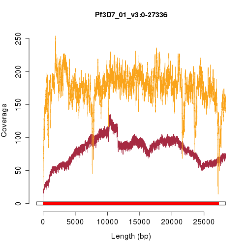 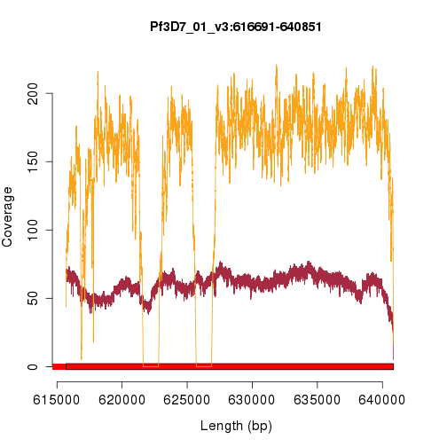 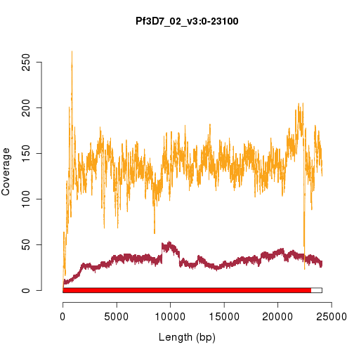 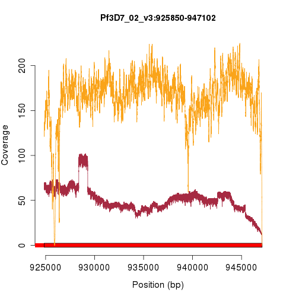 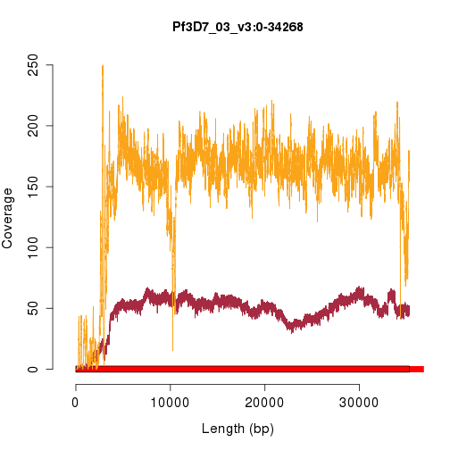 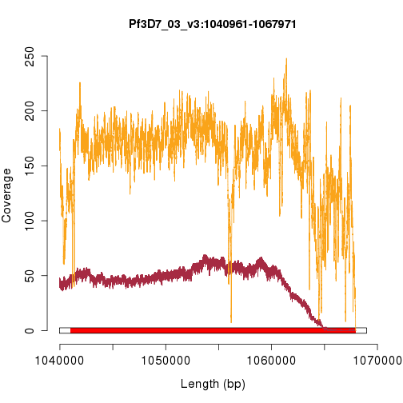 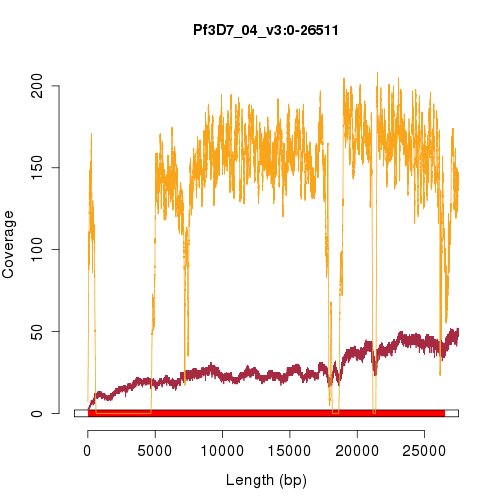 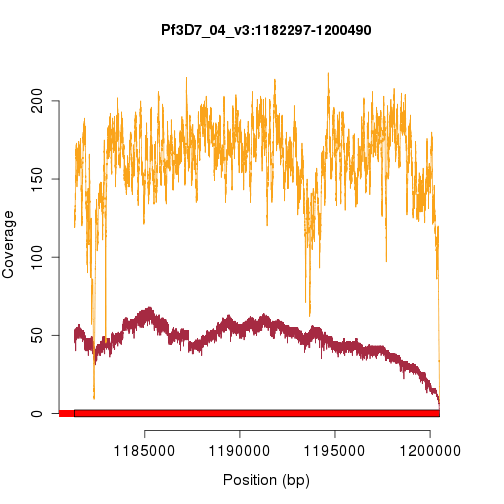  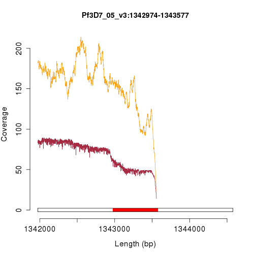 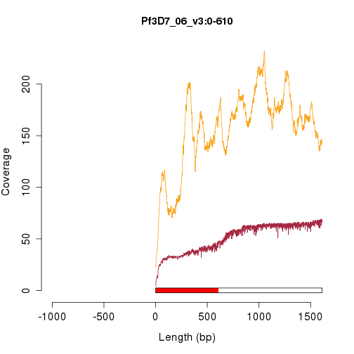 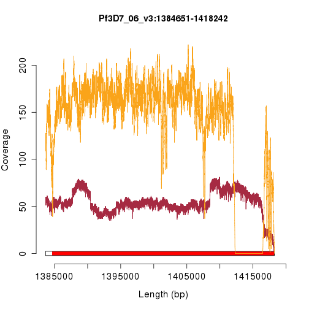 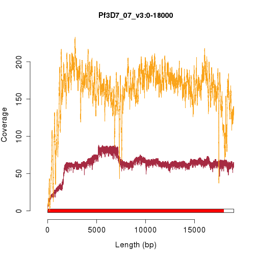 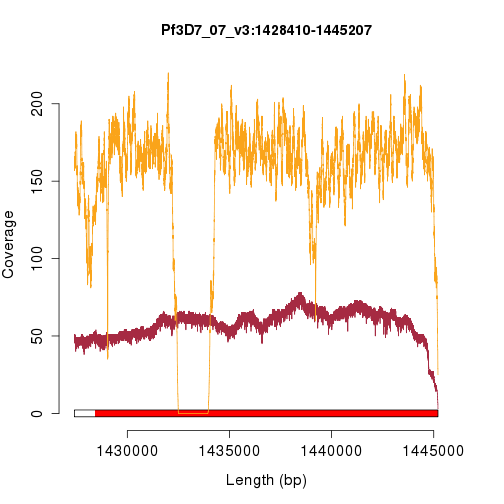 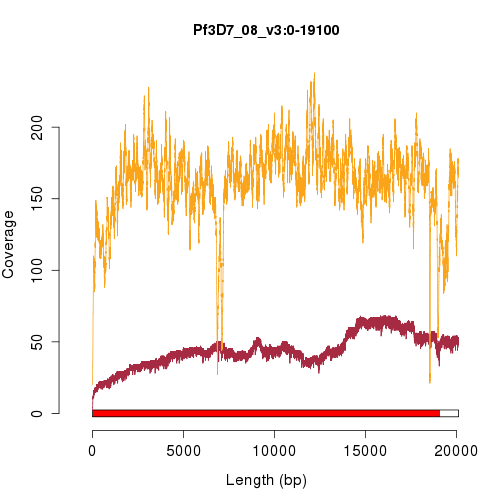 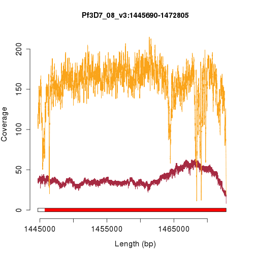 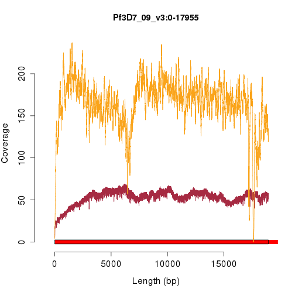 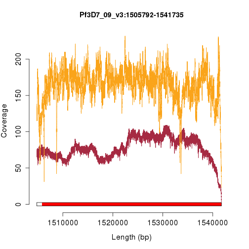 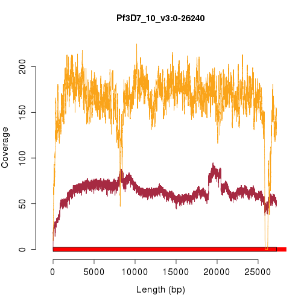 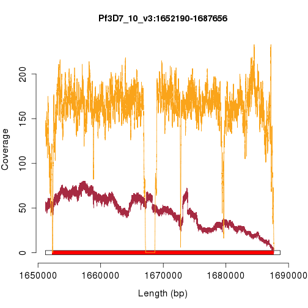 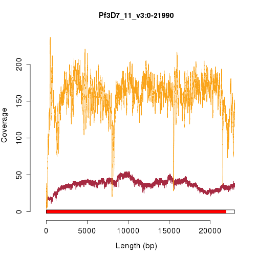 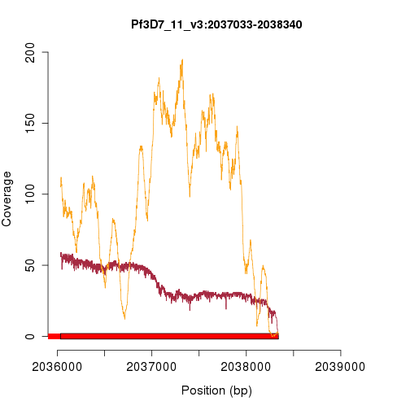 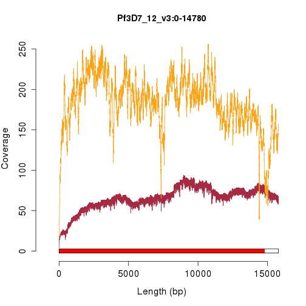 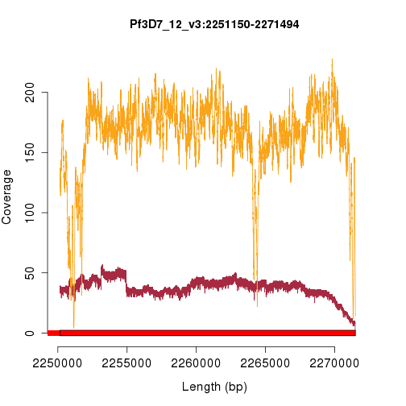 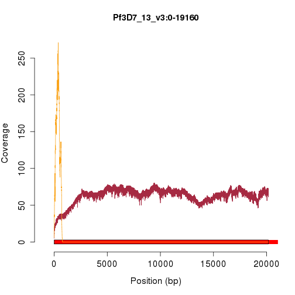 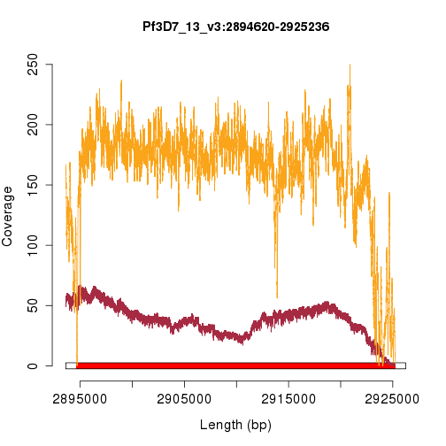 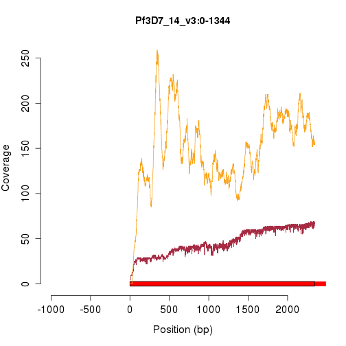 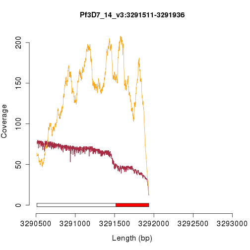 

