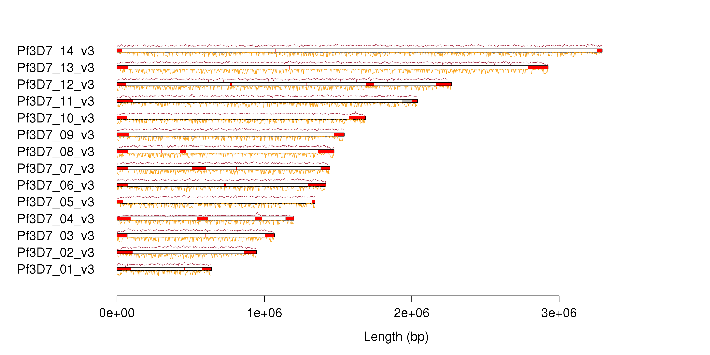
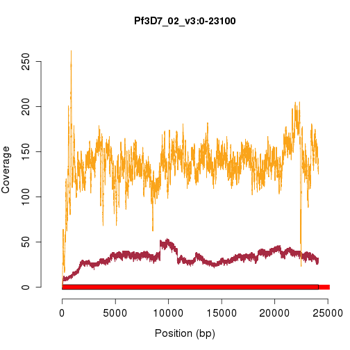
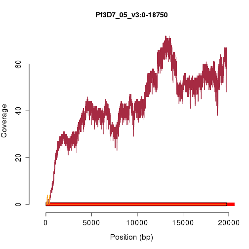
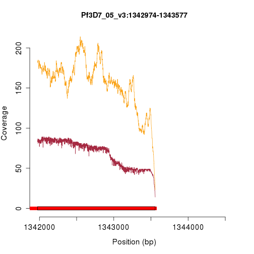
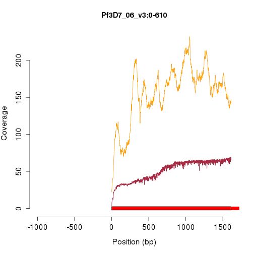
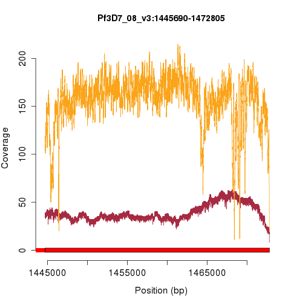
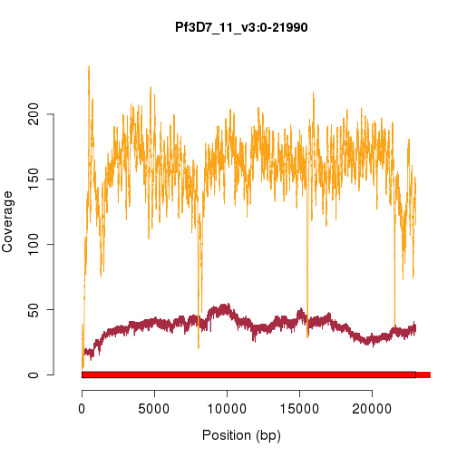

A first look at the PacBio 3D7 data
===================================

|key    |  numReads|  minLength|  maxLength|  meanLength|  n50Value|  alignedReads|  pctAligned|
|:------|---------:|----------:|----------:|-----------:|---------:|-------------:|-----------:|
|pb0    |     67425|         50|      35806|        6197|      9225|         60955|       90.40|
|pb1    |     63527|         50|      37335|        6593|      9707|         57739|       90.89|
|pb2    |     70147|         50|      40116|        6174|      9320|         63182|       90.07|
|pb3    |     76364|         50|      35377|        6379|      9277|         68084|       89.16|
|pb4    |     49238|         50|      33801|        5700|      8719|         45800|       93.02|
|pb5    |     36364|         50|      35002|        5503|      8490|         33104|       91.04|
|pb6    |     33385|         50|      34139|        5461|      8389|         29940|       89.68|
|pb7    |     30082|         50|      35126|        5071|      8055|         26897|       89.41|
|total  |    426532|         50|      40116|        6031|      9058|        385701|       90.43|

 

 

 

 

                            

 

