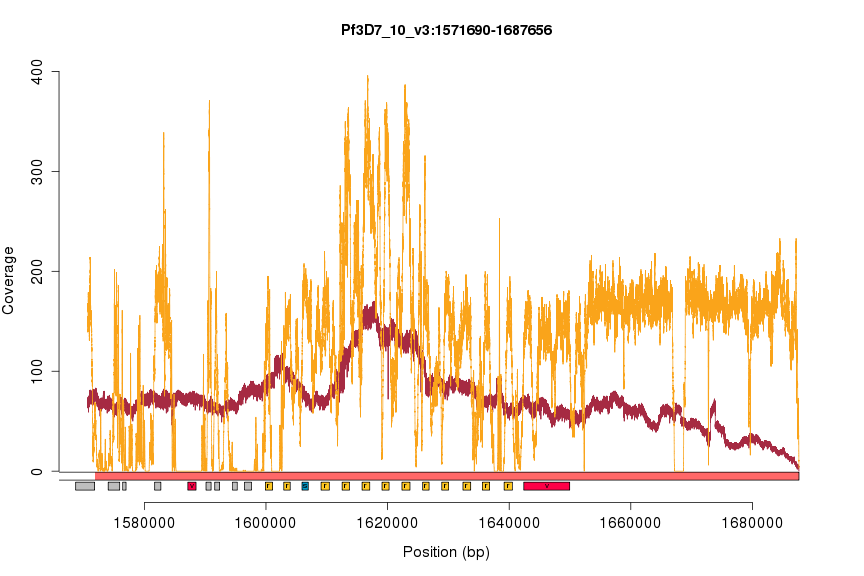

A first look at the PacBio 3D7 data
===================================


We prepared roughly 15ug of DNA from the canonical Plasmodium falciparum strain, 3D7, for sequencing on Cold Spring Harbor Laboratory's PacBio RS-II instrument.  This was sequenced on eight SMRT cells, which should yield approximately 100x coverage over the 23 megabase genome.  Having just received the filtered subreads (in unaligned and aligned form), we investigated some very basic properties of the data.

Read length
===========

|key    |  numReads|  minLength|  maxLength|  meanLength|  n50Value|
|:------|---------:|----------:|----------:|-----------:|---------:|
|pb0    |     67425|         50|      35806|        6197|      9225|
|pb1    |     63527|         50|      37335|        6593|      9707|
|pb2    |     70147|         50|      40116|        6174|      9320|
|pb3    |     76364|         50|      35377|        6379|      9277|
|pb4    |     49238|         50|      33801|        5700|      8719|
|pb5    |     36364|         50|      35002|        5503|      8490|
|pb6    |     33385|         50|      34139|        5461|      8389|
|pb7    |     30082|         50|      35126|        5071|      8055|
|total  |    426532|         50|      40116|        6031|      9058|


We first examined read count and read length properties, as shown in the table above.  We have labeled data from each SMRT cell with a simple identifier, pb0 .. pb7 (the full identifier is a bit long and cumbersome to use everywhere). On average, each SMRT cell yields 5.3316 &times; 10<sup>4</sup> reads, typically 5884.704 +/- 527.5589 bases long.

We next examined the read length distribution, shown below.

 


Interestingly, this distribution appears to be bimodal, with peaks at 1.1 kb and 8.0 kb.  The origin of these peaks are unclear.  Furthermore, they appear in all SMRT cells (see figure below), which could indicate a property of the library used for sequencing.  It is not clear whether this bimodality is from the original DNA sample or an artifact of the long-fragment library construction process.

 


Read alignment
==============


We next examined the alignment of the reads to the reference (as performed by CSHL using `pbalign`(?)).  To guide our expectations, we compare the PacBio alignments of the long-read data to BWA alignments of short-read data Illumina data (paired-end, 76-bp, ~200 bp fragment size) from the same parasite.  However, please note that the DNA source library for these two experiments is not the same.  The Illumina data is from sample PG0051-C, the 3D7 isolate sequenced on an Illumina GA2 for the P.f. crosses project.  The coverage metrics over the whole of chromosome 8 are listed in the table below:

|id        |  median|    mean|     sd|
|:---------|-------:|-------:|------:|
|PacBio    |      81|   80.87|  14.36|
|Illumina  |     132|  118.75|  62.52|


 


We manually inspected the alignments in IGV across the entire length of chromosome 1.


Strikingly, the PacBio data appears to have uniform coverage across the entire length of chromosome 1, while the Illumina data shows many peaks and valleys along the same chromosome.  Zooming in closer (below), we can see that the PacBio reads are replete with insertions, typically one base long, as expected.


Genome accessibility
--------------------

We sought to examine regions of the P. falciparum genome that are inaccessible with Illumina reads but accessible with PacBio reads.  We computed coverage profiles across each autosome by computing coverage at every nucleotide using the GATK's `DepthOfCoverage` tool, and showing the minimum coverage value found in 2,000-bp bins.  We've plotted the PacBio coverage above the appropriate ideogram and the Illumina coverage underneath it (and flipped upside-down) in the plot below.  Red and gray regions indicate areas of the genome deemed to be inaccessible (from Alistair Miles's accessibility calculations on MalariaGen datasets, personal communication).

 


It is evident that the PacBio coverage is roughly uniform across the entire length of the chromosome.  In contrast, the Illumina coverage spikes and dips as it moves along, reaching zero coverage in many regions (especially the biologically interesting subtelomeric repetitive regions).  Let us examine a few of these places more closely.


### Centromere on chromosome 4
 


### All 28 masked telomeric regions
                            


Error rate along the length of the read
---------------------------------------

Finally, we examined the error rate as a function of distance from the center of the contig (this is a slightly more meaningful measure for contigs, where it is easy to see error piling up towards the end of contigs, associated with the end of a graph traversal, but we have the code so we might as well look).  Here, we take a read, fold it in half, and start measuring the rate of insertion and deletion errors as a function of distance from the center of the read.  The result is shown below.  Insertion and deletion errors are found uniformly along the length of the reads.  Towards the tail end, we start to see a lot more variance in this rate as reads that reach these lengths become more infrequent.

 


AsmTest1, the first assembly attempt
------------------------------------

To construct an initial draft assembly, we ran the `RS_HGAP_Assembly.2` secondary analysis protocol available in SMRT Portal.  Briefly, this processing protocol performs the following steps:

1. Extract subreads (genomic sequence absent of the SMRT bell adaptors used to circularize the fragment and enable the polymerase to read it in multiple passes).
2. Filter out low quality subreads.
3. Compute a subread length threshold such that subreads greater than or equal to this length provide roughly 30x genome coverage.
4. Select "seed" reads based on the computed subread length threshold.
5. Map all of the filtered subreads to the seed reads using `BLASR`.
6. Determine a consensus sequence from the subread alignments to the seed reads and preassemble (i.e. error-correct) the reads.
7. Assemble the preassembled reads using the Celera overlap-consensus-layout assembler.
8. Refine the assembly by mapping all raw data to the new assembly using `BLASR` and trimming low-quality ends of contigs.
9. Improve the continuity of the assembly and remove errors using the quality-aware consensus algorithm, `Quiver`. 

With the exception of the estimated genome size parameter (which we set to 23,000,000 bp), we left all default settings in this protocol unchanged.  Basic metrics on the resulting assembly, hereafter referred to as "AsmTest1", are presented in the table below.  For comparison, we have also provided metrics on every *P. falciparum* assembly currently available.

|id  |id        |  numContigs|  minLength|  maxLength|  meanLength|      n50|  totalSequence|
|:---|:---------|-----------:|----------:|----------:|-----------:|--------:|--------------:|
|1   |3D7       |          16|       5967|    3291936|     1458302|  1687656|       23332831|
|10  |IT        |          17|       6616|    3219929|     1351588|  1570953|       22976997|
|3   |AsmTest1  |          34|      11443|    3293905|      697875|  1696391|       23727741|
|9   |IGH-CR14  |         849|       2199|     120285|       25608|    37016|       21741172|
|8   |HB3       |        1189|        201|     377975|       20402|    96469|       24258511|
|13  |RAJ116    |        1199|       2042|      70306|       11765|    12998|       14106529|
|6   |DD2       |        2837|        201|     102309|        7358|    19112|       20875591|
|16  |V34.04    |        4329|        226|      16341|        3059|     3756|       13240777|
|4   |D10       |        4471|        259|      19127|        2992|     3707|       13375079|
|11  |K1        |        4772|        231|      18390|        2785|     3422|       13290906|
|2   |7G8       |        4843|        204|      19000|        2948|     3832|       14278891|
|7   |FCC-2     |        4956|        200|      17581|        2616|     3302|       12963854|
|14  |RO-33     |        4991|        208|      19991|        2748|     3473|       13714138|
|5   |D6        |        5011|        266|      15451|        2638|     3231|       13216528|
|15  |SL        |        5193|        214|      55682|        2540|     3079|       13192745|
|17  |VS.1      |        5856|        201|      22989|        3225|     4424|       18887633|
|12  |PFCLIN    |       18711|       1001|      33813|        2366|     2992|       44265486|


The AsmTest1 assembly compares quite favorably to the best assemblies, with 34 compared to 3D7's 16 and IT's 17.  The longest chromosome in the *P. falciparum* genome is chromosome 14 (3291936 bp).  The longest contig in the AsmTest1 assembly appears roughly this length, suggesting that we may have assemblied the majority (or the entirety) of chromosome 14 in a single contig.

We compared AsmTest1 to the 3D7 canonical genome by aligning the two with `MUMMER`.


```
## Warning: NAs introduced by coercion
```

 


