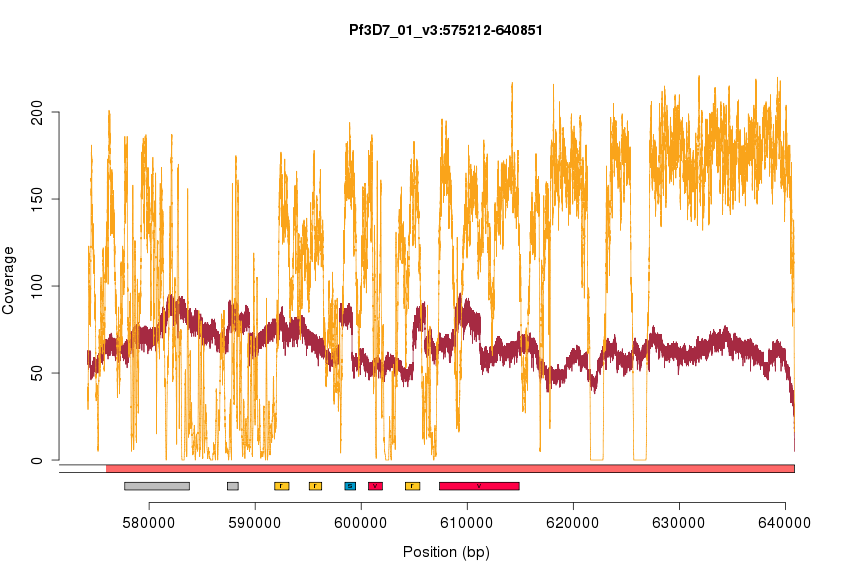

A first look at the PacBio 3D7 data
===================================


We prepared roughly 15ug of DNA from the canonical Plasmodium falciparum strain, 3D7, for sequencing on Cold Spring Harbor Laboratory's PacBio RS-II instrument.  This was sequenced on eight SMRT cells, which should yield approximately 100x coverage over the 23 megabase genome.  Having just received the filtered subreads (in unaligned and aligned form), we investigated some very basic properties of the data.

Read length
===========

|key    |  numReads|  minLength|  maxLength|  meanLength|  n50Value|
|:------|---------:|----------:|----------:|-----------:|---------:|
|pb0    |     67425|         50|      35806|        6197|      9225|
|pb1    |     63527|         50|      37335|        6593|      9707|
|pb2    |     70147|         50|      40116|        6174|      9320|
|pb3    |     76364|         50|      35377|        6379|      9277|
|pb4    |     49238|         50|      33801|        5700|      8719|
|pb5    |     36364|         50|      35002|        5503|      8490|
|pb6    |     33385|         50|      34139|        5461|      8389|
|pb7    |     30082|         50|      35126|        5071|      8055|
|total  |    426532|         50|      40116|        6031|      9058|


We first examined read count and read length properties, as shown in the table above.  We have labeled data from each SMRT cell with a simple identifier, pb0 .. pb7 (the full identifier is a bit long and cumbersome to use everywhere). On average, each SMRT cell yields 5.3316 &times; 10<sup>4</sup> reads, typically 5884.704 +/- 527.5589 bases long.

We next examined the read length distribution, shown below.

 


Interestingly, this distribution appears to be bimodal, with peaks at 1.1 kb and 8.0 kb.  The origin of these peaks are unclear.  Furthermore, they appear in all SMRT cells (see figure below), which could indicate a property of the library used for sequencing.  It is not clear whether this bimodality is from the original DNA sample or an artifact of the long-fragment library construction process.

 


Read alignment
==============


We next examined the alignment of the reads to the reference (as performed by CSHL using `pbalign`(?)).  To guide our expectations, we compare the PacBio alignments of the long-read data to BWA alignments of short-read data Illumina data (paired-end, 76-bp, ~200 bp fragment size) from the same parasite.  However, please note that the DNA source library for these two experiments is not the same.  The Illumina data is from sample PG0051-C, the 3D7 isolate sequenced on an Illumina GA2 for the P.f. crosses project.  The coverage metrics over the whole of chromosome 8 are listed in the table below:

|id        |  median|    mean|     sd|
|:---------|-------:|-------:|------:|
|PacBio    |      81|   80.87|  14.36|
|Illumina  |     132|  118.75|  62.52|


 


We manually inspected the alignments in IGV across the entire length of chromosome 1.


Strikingly, the PacBio data appears to have uniform coverage across the entire length of chromosome 1, while the Illumina data shows many peaks and valleys along the same chromosome.  Zooming in closer (below), we can see that the PacBio reads are replete with insertions, typically one base long, as expected.


Genome accessibility
--------------------

We sought to examine regions of the P. falciparum genome that are inaccessible with Illumina reads but accessible with PacBio reads.  We computed coverage profiles across each autosome by computing coverage at every nucleotide using the GATK's `DepthOfCoverage` tool, and showing the minimum coverage value found in 2,000-bp bins.  We've plotted the PacBio coverage above the appropriate ideogram and the Illumina coverage underneath it (and flipped upside-down) in the plot below.  Red and gray regions indicate areas of the genome deemed to be inaccessible (from Alistair Miles's accessibility calculations on MalariaGen datasets, personal communication).

 


It is evident that the PacBio coverage is roughly uniform across the entire length of the chromosome.  In contrast, the Illumina coverage spikes and dips as it moves along, reaching zero coverage in many regions (especially the biologically interesting subtelomeric repetitive regions).  Let us examine a few of these places more closely.


### Centromere on chromosome 4
 

```
##          chrom  start   stop       type
## 27 Pf3D7_04_v3 632003 654529 Centromere
##           chrom  start   stop            gene
## 795 Pf3D7_04_v3 626891 633126   PF3D7_0414000
## 796 Pf3D7_04_v3 634029 638905   PF3D7_0414100
## 797 Pf3D7_04_v3 647389 648388 PF3D7_0414200.1
## 798 Pf3D7_04_v3 647389 648388 PF3D7_0414200.2
## 799 Pf3D7_04_v3 649893 650731   PF3D7_0414300
## 800 Pf3D7_04_v3 652350 653554   PF3D7_0414400
## 801 Pf3D7_04_v3 655025 657314   PF3D7_0414500
##                                                 description color text
## 795                 chromosome associated protein, putative  gray     
## 796 conserved Plasmodium membrane protein, unknown function  gray     
## 797                                 calmodulin-like protein  gray     
## 798                                 calmodulin-like protein  gray     
## 799          conserved Plasmodium protein, unknown function  gray     
## 800          conserved Plasmodium protein, unknown function  gray     
## 801                           RNA binding protein, putative  gray
```


### All 28 masked telomeric regions
 

```
##        sample       chrom co_pos_mid start  stop co_pos_range cross
## 1 all/all/all Pf3D7_05_v3          0     1 37959            0   all
##   co_from_parent co_to_parent
## 1            all          all
##           chrom start  stop          gene
## 917 Pf3D7_05_v3 20929 28456 PF3D7_0500100
## 918 Pf3D7_05_v3 29233 29304 PF3D7_0500200
## 919 Pf3D7_05_v3 29776 30963 PF3D7_0500300
## 920 Pf3D7_05_v3 33056 34378 PF3D7_0500400
## 921 Pf3D7_05_v3 36464 37564 PF3D7_0500500
##                                             description   color text
## 917        erythrocyte membrane protein 1, PfEMP1 (VAR) #FF0047    v
## 918 erythrocyte membrane protein 1 (PfEMP1), pseudogene #FF0047    v
## 919                                   rifin, pseudogene #FFC821    r
## 920                                         rifin (RIF) #FFC821    r
## 921                                         rifin (RIF) #FFC821    r
```

 

```
##        sample       chrom co_pos_mid start  stop co_pos_range cross
## 2 all/all/all Pf3D7_10_v3          0     1 70764            0   all
##   co_from_parent co_to_parent
## 2            all          all
##            chrom start  stop            gene
## 2638 Pf3D7_10_v3 28490 36164   PF3D7_1000100
## 2639 Pf3D7_10_v3 38050 39395   PF3D7_1000200
## 2640 Pf3D7_10_v3 41773 42963   PF3D7_1000300
## 2641 Pf3D7_10_v3 44816 46133   PF3D7_1000400
## 2642 Pf3D7_10_v3 48052 49384   PF3D7_1000500
## 2643 Pf3D7_10_v3 51349 52599   PF3D7_1000600
## 2644 Pf3D7_10_v3 54542 55498   PF3D7_1000700
## 2645 Pf3D7_10_v3 57968 58980   PF3D7_1000800
## 2646 Pf3D7_10_v3 60024 61365   PF3D7_1000900
## 2647 Pf3D7_10_v3 63152 64032   PF3D7_1001000
## 2648 Pf3D7_10_v3 67807 68961 PF3D7_1001100.1
## 2649 Pf3D7_10_v3 67807 68961 PF3D7_1001100.2
## 2650 Pf3D7_10_v3 70547 70819   PF3D7_1001200
##                                                        description   color
## 2638                  erythrocyte membrane protein 1, PfEMP1 (VAR) #FF0047
## 2639                                                   rifin (RIF) #FFC821
## 2640                                                   rifin (RIF) #FFC821
## 2641                                                   rifin (RIF) #FFC821
## 2642                                                   rifin (RIF) #FFC821
## 2643                                                   rifin (RIF) #FFC821
## 2644     Plasmodium exported protein, unknown function, pseudogene    gray
## 2645                                            stevor, pseudogene #009BCC
## 2646            erythrocyte membrane protein 1 (PfEMP1), truncated #FF0047
## 2647 Plasmodium exported protein (hyp12), unknown function (PfJ13)    gray
## 2648            acyl-CoA binding protein, isoform 1, ACBP1 (ACBP1)    gray
## 2649                    acyl-CoA binding protein, isoform 1, ACBP1    gray
## 2650            acyl-CoA binding protein, isoform 2, ACBP2 (ACBP2)    gray
##      text
## 2638    v
## 2639    r
## 2640    r
## 2641    r
## 2642    r
## 2643    r
## 2644     
## 2645    s
## 2646    v
## 2647     
## 2648     
## 2649     
## 2650
```

 

```
##        sample       chrom co_pos_mid start  stop co_pos_range cross
## 3 all/all/all Pf3D7_07_v3          0     1 77258            0   all
##   co_from_parent co_to_parent
## 3            all          all
##            chrom start  stop          gene
## 1583 Pf3D7_07_v3 20307 28083 PF3D7_0700100
## 1584 Pf3D7_07_v3 30097 31269 PF3D7_0700200
## 1585 Pf3D7_07_v3 33585 34804 PF3D7_0700300
## 1586 Pf3D7_07_v3 36922 37927 PF3D7_0700400
## 1587 Pf3D7_07_v3 40288 41453 PF3D7_0700500
## 1588 Pf3D7_07_v3 43192 44140 PF3D7_0700600
## 1589 Pf3D7_07_v3 45559 46607 PF3D7_0700700
## 1590 Pf3D7_07_v3 48300 49106 PF3D7_0700800
## 1591 Pf3D7_07_v3 49779 50832 PF3D7_0700900
## 1592 Pf3D7_07_v3 52086 53636 PF3D7_0701000
## 1593 Pf3D7_07_v3 55562 56781 PF3D7_0701100
## 1594 Pf3D7_07_v3 59277 60366 PF3D7_0701200
## 1595 Pf3D7_07_v3 62220 63401 PF3D7_0701300
## 1596 Pf3D7_07_v3 65718 66854 PF3D7_0701400
## 1597 Pf3D7_07_v3 68066 68840 PF3D7_0701500
## 1598 Pf3D7_07_v3 71049 71860 PF3D7_0701600
## 1599 Pf3D7_07_v3 72477 73325 PF3D7_0701700
## 1600 Pf3D7_07_v3 75918 77055 PF3D7_0701800
##                                                           description
## 1583                     erythrocyte membrane protein 1, PfEMP1 (VAR)
## 1584                                                      rifin (RIF)
## 1585                                                      rifin (RIF)
## 1586                                                           stevor
## 1587                                                      rifin (RIF)
## 1588        Plasmodium exported protein, unknown function, pseudogene
## 1589                                               stevor, pseudogene
## 1590       Pfmc-2TM Maurer's cleft two transmembrane protein (MC-2TM)
## 1591                                    RESA-like protein, pseudogene
## 1592              erythrocyte membrane protein 1 (PfEMP1), pseudogene
## 1593                                                      rifin (RIF)
## 1594                                          rifin, pseudogene (RIF)
## 1595                                                rifin, pseudogene
## 1596 Plasmodium exported protein (hyp5), unknown function, pseudogene
## 1597             Plasmodium exported protein (hyp4), unknown function
## 1598       Pfmc-2TM Maurer's cleft two transmembrane protein (MC-2TM)
## 1599                                                RESA-like protein
## 1600                                                      rifin (RIF)
##        color text
## 1583 #FF0047    v
## 1584 #FFC821    r
## 1585 #FFC821    r
## 1586 #009BCC    s
## 1587 #FFC821    r
## 1588    gray     
## 1589 #009BCC    s
## 1590    gray     
## 1591    gray     
## 1592 #FF0047    v
## 1593 #FFC821    r
## 1594 #FFC821    r
## 1595 #FFC821    r
## 1596    gray     
## 1597    gray     
## 1598    gray     
## 1599    gray     
## 1600 #FFC821    r
```

 

```
##        sample       chrom co_pos_mid start  stop co_pos_range cross
## 4 all/all/all Pf3D7_03_v3          0     1 73728            0   all
##   co_from_parent co_to_parent
## 4            all          all
##           chrom start  stop          gene
## 402 Pf3D7_03_v3 36965 44482 PF3D7_0300100
## 403 Pf3D7_03_v3 46369 47579 PF3D7_0300200
## 404 Pf3D7_03_v3 49772 51152 PF3D7_0300300
## 405 Pf3D7_03_v3 52280 53273 PF3D7_0300400
## 406 Pf3D7_03_v3 55390 56584 PF3D7_0300500
## 407 Pf3D7_03_v3 58307 58519 PF3D7_0300600
## 408 Pf3D7_03_v3 61445 62714 PF3D7_0300700
## 409 Pf3D7_03_v3 64572 65783 PF3D7_0300800
## 410 Pf3D7_03_v3 67928 68682 PF3D7_0300900
## 411 Pf3D7_03_v3 69460 71919 PF3D7_0301000
##                                                                     description
## 402                                erythrocyte membrane protein 1, PfEMP1 (VAR)
## 403                                                                 rifin (RIF)
## 404 erythrocyte membrane protein 1 (PfEMP1), exon2, pseudogene (VAR pseudogene)
## 405                                                                      stevor
## 406                                                                 rifin (RIF)
## 407                     Plasmodium exported protein, unknown function, fragment
## 408                                                                 rifin (RIF)
## 409                                                                 rifin (RIF)
## 410                                                                 stevor-like
## 411                                                  acyl-CoA synthetase (ACS2)
##       color text
## 402 #FF0047    v
## 403 #FFC821    r
## 404 #FF0047    v
## 405 #009BCC    s
## 406 #FFC821    r
## 407    gray     
## 408 #FFC821    r
## 409 #FFC821    r
## 410 #009BCC    s
## 411    gray
```

 

```
##        sample       chrom co_pos_mid start  stop co_pos_range cross
## 5 all/all/all Pf3D7_13_v3          0     1 75437            0   all
##   co_from_parent co_to_parent
## 5            all          all
##            chrom start  stop          gene
## 4128 Pf3D7_13_v3 21364 28787 PF3D7_1300100
## 4129 Pf3D7_13_v3 30605 31881 PF3D7_1300200
## 4130 Pf3D7_13_v3 33959 44742 PF3D7_1300300
## 4131 Pf3D7_13_v3 47583 48769 PF3D7_1300400
## 4132 Pf3D7_13_v3 50662 51857 PF3D7_1300500
## 4133 Pf3D7_13_v3 54067 55259 PF3D7_1300600
## 4134 Pf3D7_13_v3 57109 58422 PF3D7_1300700
## 4135 Pf3D7_13_v3 60097 61172 PF3D7_1300800
## 4136 Pf3D7_13_v3 62515 63547 PF3D7_1300900
## 4137 Pf3D7_13_v3 65548 66816 PF3D7_1301000
## 4138 Pf3D7_13_v3 68484 69411 PF3D7_1301100
## 4139 Pf3D7_13_v3 73099 74413 PF3D7_1301200
##                                                             description
## 4128                       erythrocyte membrane protein 1, PfEMP1 (VAR)
## 4129                                                        rifin (RIF)
## 4130                       erythrocyte membrane protein 1, PfEMP1 (VAR)
## 4131                                                        rifin (RIF)
## 4132                                                        rifin (RIF)
## 4133                                                        rifin (RIF)
## 4134                                                        rifin (RIF)
## 4135                     erythrocyte membrane protein 1-like (VAR-like)
## 4136                                                    stevor (stevor)
## 4137                                            rifin, pseudogene (RIF)
## 4138 Plasmodium exported protein (PHISTa), unknown function, pseudogene
## 4139                                glycophorin binding protein (GBPH2)
##        color text
## 4128 #FF0047    v
## 4129 #FFC821    r
## 4130 #FF0047    v
## 4131 #FFC821    r
## 4132 #FFC821    r
## 4133 #FFC821    r
## 4134 #FFC821    r
## 4135 #FF0047    v
## 4136 #009BCC    s
## 4137 #FFC821    r
## 4138    gray     
## 4139    gray
```

 

```
##        sample       chrom co_pos_mid start   stop co_pos_range cross
## 6 all/all/all Pf3D7_11_v3          0     1 110097            0   all
##   co_from_parent co_to_parent
## 6            all          all
##            chrom  start   stop          gene
## 3059 Pf3D7_11_v3  24160  31598 PF3D7_1100100
## 3060 Pf3D7_11_v3  32666  42386 PF3D7_1100200
## 3061 Pf3D7_11_v3  45056  46233 PF3D7_1100300
## 3062 Pf3D7_11_v3  48112  49307 PF3D7_1100400
## 3063 Pf3D7_11_v3  51623  52751 PF3D7_1100500
## 3064 Pf3D7_11_v3  54423  55371 PF3D7_1100600
## 3065 Pf3D7_11_v3  56792  57840 PF3D7_1100700
## 3066 Pf3D7_11_v3  59550  60328 PF3D7_1100800
## 3067 Pf3D7_11_v3  60928  61769 PF3D7_1100900
## 3068 Pf3D7_11_v3  64441  64842 PF3D7_1101000
## 3069 Pf3D7_11_v3  66686  67965 PF3D7_1101100
## 3070 Pf3D7_11_v3  70081  71289 PF3D7_1101200
## 3071 Pf3D7_11_v3  73244  74442 PF3D7_1101300
## 3072 Pf3D7_11_v3  76820  78000 PF3D7_1101400
## 3073 Pf3D7_11_v3  80306  81424 PF3D7_1101500
## 3074 Pf3D7_11_v3  82633  83415 PF3D7_1101600
## 3075 Pf3D7_11_v3  85629  86418 PF3D7_1101700
## 3076 Pf3D7_11_v3  87041  87889 PF3D7_1101800
## 3077 Pf3D7_11_v3  90446  90874 PF3D7_1101900
## 3078 Pf3D7_11_v3  96964  99609 PF3D7_1102000
## 3079 Pf3D7_11_v3 104300 104852 PF3D7_1102100
## 3080 Pf3D7_11_v3 105357 107235 PF3D7_1102200
## 3081 Pf3D7_11_v3 110027 111429 PF3D7_1102300
##                                                             description
## 3059                       erythrocyte membrane protein 1, PfEMP1 (VAR)
## 3060                       erythrocyte membrane protein 1, PfEMP1 (VAR)
## 3061                                                        rifin (RIF)
## 3062                                                        rifin (RIF)
## 3063                                                        rifin (RIF)
## 3064 Plasmodium exported protein (PHISTa), unknown function, pseudogene
## 3065                                                 stevor, pseudogene
## 3066         Pfmc-2TM Maurer's cleft two transmembrane protein (MC-2TM)
## 3067                                      RESA-like protein, pseudogene
## 3068                 erythrocyte membrane protein 1 (PfEMP1), truncated
## 3069                                                        rifin (RIF)
## 3070                                                        rifin (RIF)
## 3071                                                        rifin (RIF)
## 3072                                            rifin, pseudogene (RIF)
## 3073               Plasmodium exported protein (hyp5), unknown function
## 3074               Plasmodium exported protein (hyp4), unknown function
## 3075         Pfmc-2TM Maurer's cleft two transmembrane protein (MC-2TM)
## 3076                                                  RESA-like protein
## 3077     erythrocyte membrane protein 1 (PfEMP1), truncated, pseudogene
## 3078                                               hypothetical protein
## 3079          Plasmodium exported protein, unknown function, pseudogene
## 3080                                             DnaJ protein, putative
## 3081                      Plasmodium exported protein, unknown function
##        color text
## 3059 #FF0047    v
## 3060 #FF0047    v
## 3061 #FFC821    r
## 3062 #FFC821    r
## 3063 #FFC821    r
## 3064    gray     
## 3065 #009BCC    s
## 3066    gray     
## 3067    gray     
## 3068 #FF0047    v
## 3069 #FFC821    r
## 3070 #FFC821    r
## 3071 #FFC821    r
## 3072 #FFC821    r
## 3073    gray     
## 3074    gray     
## 3075    gray     
## 3076    gray     
## 3077 #FF0047    v
## 3078    gray     
## 3079    gray     
## 3080    gray     
## 3081    gray
```

 

```
##        sample       chrom co_pos_mid start  stop co_pos_range cross
## 7 all/all/all Pf3D7_14_v3          0     1 35908            0   all
##   co_from_parent co_to_parent
## 7            all          all
##            chrom start  stop          gene
## 4864 Pf3D7_14_v3  1393  5343 PF3D7_1400100
## 4865 Pf3D7_14_v3  7208  8538 PF3D7_1400200
## 4866 Pf3D7_14_v3 10974 12117 PF3D7_1400300
## 4867 Pf3D7_14_v3 14126 15363 PF3D7_1400400
## 4868 Pf3D7_14_v3 17469 18808 PF3D7_1400500
## 4869 Pf3D7_14_v3 20897 22232 PF3D7_1400600
## 4870 Pf3D7_14_v3 24337 25320 PF3D7_1400700
## 4871 Pf3D7_14_v3 27321 28428 PF3D7_1400800
## 4872 Pf3D7_14_v3 30083 31008 PF3D7_1400900
## 4873 Pf3D7_14_v3 34693 35773 PF3D7_1401000
##                                                             description
## 4864     erythrocyte membrane protein 1 (PfEMP1), truncated, pseudogene
## 4865                                                        rifin (RIF)
## 4866                                                        rifin (RIF)
## 4867                                                        rifin (RIF)
## 4868                                                        rifin (RIF)
## 4869                                                        rifin (RIF)
## 4870                                                             stevor
## 4871                                                        rifin (RIF)
## 4872 Plasmodium exported protein (PHISTa), unknown function, pseudogene
## 4873                                 glycophorin binding protein (GBPH)
##        color text
## 4864 #FF0047    v
## 4865 #FFC821    r
## 4866 #FFC821    r
## 4867 #FFC821    r
## 4868 #FFC821    r
## 4869 #FFC821    r
## 4870 #009BCC    s
## 4871 #FFC821    r
## 4872    gray     
## 4873    gray
```

 

```
##        sample       chrom co_pos_mid start  stop co_pos_range cross
## 8 all/all/all Pf3D7_09_v3          0     1 80793            0   all
##   co_from_parent co_to_parent
## 8            all          all
##            chrom start  stop          gene
## 2252 Pf3D7_09_v3 20080 27885 PF3D7_0900100
## 2253 Pf3D7_09_v3 29797 31157 PF3D7_0900200
## 2254 Pf3D7_09_v3 33553 34795 PF3D7_0900300
## 2255 Pf3D7_09_v3 39554 40740 PF3D7_0900400
## 2256 Pf3D7_09_v3 42909 44045 PF3D7_0900500
## 2257 Pf3D7_09_v3 45902 47236 PF3D7_0900600
## 2258 Pf3D7_09_v3 49612 50971 PF3D7_0900700
## 2259 Pf3D7_09_v3 52648 54020 PF3D7_0900800
## 2260 Pf3D7_09_v3 55074 56081 PF3D7_0900900
## 2261 Pf3D7_09_v3 58162 59240 PF3D7_0901000
## 2262 Pf3D7_09_v3 61342 62553 PF3D7_0901100
## 2263 Pf3D7_09_v3 64216 64428 PF3D7_0901200
## 2264 Pf3D7_09_v3 67334 68625 PF3D7_0901300
## 2265 Pf3D7_09_v3 70521 71738 PF3D7_0901400
## 2266 Pf3D7_09_v3 74409 75746 PF3D7_0901500
## 2267 Pf3D7_09_v3 77861 78874 PF3D7_0901600
##                                                                      description
## 2252                                erythrocyte membrane protein 1, PfEMP1 (VAR)
## 2253                                                                 rifin (RIF)
## 2254                                                                 rifin (RIF)
## 2255                                                                 rifin (RIF)
## 2256                                                                 rifin (RIF)
## 2257                                                                 rifin (RIF)
## 2258                                                                 rifin (RIF)
## 2259 erythrocyte membrane protein 1 (PfEMP1), exon2, pseudogene (VAR pseudogene)
## 2260                                                             stevor (STEVOR)
## 2261                                                                 rifin (RIF)
## 2262                                                                 rifin (RIF)
## 2263                     Plasmodium exported protein, unknown function, fragment
## 2264                                                                 rifin (RIF)
## 2265                                                                 rifin (RIF)
## 2266                                                                 rifin (RIF)
## 2267                                                             stevor (STEVOR)
##        color text
## 2252 #FF0047    v
## 2253 #FFC821    r
## 2254 #FFC821    r
## 2255 #FFC821    r
## 2256 #FFC821    r
## 2257 #FFC821    r
## 2258 #FFC821    r
## 2259 #FF0047    v
## 2260 #009BCC    s
## 2261 #FFC821    r
## 2262 #FFC821    r
## 2263    gray     
## 2264 #FFC821    r
## 2265 #FFC821    r
## 2266 #FFC821    r
## 2267 #009BCC    s
```

 

```
##        sample       chrom co_pos_mid start  stop co_pos_range cross
## 9 all/all/all Pf3D7_01_v3          0     1 93901            0   all
##   co_from_parent co_to_parent
## 9            all          all
##          chrom start  stop          gene
## 1  Pf3D7_01_v3 29510 37126 PF3D7_0100100
## 2  Pf3D7_01_v3 38982 40207 PF3D7_0100200
## 3  Pf3D7_01_v3 42367 46507 PF3D7_0100300
## 4  Pf3D7_01_v3 50363 51636 PF3D7_0100400
## 5  Pf3D7_01_v3 53169 53280 PF3D7_0100500
## 6  Pf3D7_01_v3 53778 55006 PF3D7_0100600
## 7  Pf3D7_01_v3 56690 56893 PF3D7_0100700
## 8  Pf3D7_01_v3 59772 61003 PF3D7_0100800
## 9  Pf3D7_01_v3 62187 63400 PF3D7_0100900
## 10 Pf3D7_01_v3 65817 66989 PF3D7_0101000
## 11 Pf3D7_01_v3 69304 70417 PF3D7_0101100
## 12 Pf3D7_01_v3 71624 72426 PF3D7_0101200
## 13 Pf3D7_01_v3 74563 75366 PF3D7_0101300
## 14 Pf3D7_01_v3 75982 76809 PF3D7_0101400
## 15 Pf3D7_01_v3 78241 79891 PF3D7_0101500
## 16 Pf3D7_01_v3 81765 83106 PF3D7_0101600
## 17 Pf3D7_01_v3 84791 86152 PF3D7_0101700
## 18 Pf3D7_01_v3 87203 88177 PF3D7_0101800
## 19 Pf3D7_01_v3 90242 91420 PF3D7_0101900
## 20 Pf3D7_01_v3 93113 93875 PF3D7_0102000
##                                                                      description
## 1                                   erythrocyte membrane protein 1, PfEMP1 (VAR)
## 2                                                                    rifin (RIF)
## 3                                        var-like erythrocyte membrane protein 1
## 4                                                                    rifin (RIF)
## 5    erythrocyte membrane protein 1 (PfEMP1), exon1, pseudogene (var pseudogene)
## 6                                                                    rifin (RIF)
## 7                        Plasmodium exported protein, unknown function, fragment
## 8                                                                    rifin (RIF)
## 9                                                                    rifin (RIF)
## 10                                                                   rifin (RIF)
## 11                          Plasmodium exported protein (hyp5), unknown function
## 12                          Plasmodium exported protein (hyp4), unknown function
## 13                    Pfmc-2TM Maurer's cleft two transmembrane protein (MC-2TM)
## 14                                                 RESA-like protein, pseudogene
## 15 erythrocyte membrane protein 1 (PfEMP1), exon2, pseudogene (var (pseudogene))
## 16                                                                   rifin (RIF)
## 17   erythrocyte membrane protein 1 (PfEMP1), exon2, pseudogene (var pseudogene)
## 18                                                                        stevor
## 19                                                                   rifin (RIF)
## 20            Plasmodium exported protein (PHISTa), unknown function, pseudogene
##      color text
## 1  #FF0047    v
## 2  #FFC821    r
## 3  #FF0047    v
## 4  #FFC821    r
## 5  #FF0047    v
## 6  #FFC821    r
## 7     gray     
## 8  #FFC821    r
## 9  #FFC821    r
## 10 #FFC821    r
## 11    gray     
## 12    gray     
## 13    gray     
## 14    gray     
## 15 #FF0047    v
## 16 #FFC821    r
## 17 #FF0047    v
## 18 #009BCC    s
## 19 #FFC821    r
## 20    gray
```

 

```
##         sample       chrom co_pos_mid start  stop co_pos_range cross
## 10 all/all/all Pf3D7_12_v3          0     1 60464            0   all
##    co_from_parent co_to_parent
## 10            all          all
##            chrom start  stop          gene
## 3571 Pf3D7_12_v3 16973 24497 PF3D7_1200100
## 3572 Pf3D7_12_v3 26321 27687 PF3D7_1200200
## 3573 Pf3D7_12_v3 30078 31261 PF3D7_1200300
## 3574 Pf3D7_12_v3 32703 41940 PF3D7_1200400
## 3575 Pf3D7_12_v3 43800 45106 PF3D7_1200500
## 3576 Pf3D7_12_v3 46788 56805 PF3D7_1200600
##                                           description   color text
## 3571     erythrocyte membrane protein 1, PfEMP1 (VAR) #FF0047    v
## 3572                                      rifin (RIF) #FFC821    r
## 3573                                      rifin (RIF) #FFC821    r
## 3574     erythrocyte membrane protein 1, PfEMP1 (VAR) #FF0047    v
## 3575                                      rifin (RIF) #FFC821    r
## 3576 erythrocyte membrane protein 1, PfEMP1 (VAR2CSA) #FF0047    v
```

 

```
##         sample       chrom co_pos_mid start  stop co_pos_range cross
## 11 all/all/all Pf3D7_08_v3          0     1 73793            0   all
##    co_from_parent co_to_parent
## 11            all          all
##            chrom start  stop          gene
## 1915 Pf3D7_08_v3 21361 28653 PF3D7_0800100
## 1916 Pf3D7_08_v3 29700 39033 PF3D7_0800200
## 1917 Pf3D7_08_v3 40948 50939 PF3D7_0800300
## 1918 Pf3D7_08_v3 52760 53982 PF3D7_0800400
## 1919 Pf3D7_08_v3 56352 57703 PF3D7_0800500
## 1920 Pf3D7_08_v3 61138 62135 PF3D7_0800600
## 1921 Pf3D7_08_v3 65716 71785 PF3D7_0800700
##                                                         description
## 1915                   erythrocyte membrane protein 1, PfEMP1 (VAR)
## 1916                   erythrocyte membrane protein 1, PfEMP1 (VAR)
## 1917                   erythrocyte membrane protein 1, PfEMP1 (VAR)
## 1918                                                    rifin (RIF)
## 1919                                                    rifin (RIF)
## 1920         Plasmodium exported protein (PHISTa), unknown function
## 1921 surface-associated interspersed gene 8.3 (SURFIN8.3) (SURF8.3)
##        color text
## 1915 #FF0047    v
## 1916 #FF0047    v
## 1917 #FF0047    v
## 1918 #FFC821    r
## 1919 #FFC821    r
## 1920    gray     
## 1921    gray
```

 

```
##         sample       chrom co_pos_mid start  stop co_pos_range cross
## 12 all/all/all Pf3D7_06_v3          0     1 72627            0   all
##    co_from_parent co_to_parent
## 12            all          all
##            chrom start  stop          gene
## 1250 Pf3D7_06_v3   653  1432 PF3D7_0600100
## 1251 Pf3D7_06_v3  3503 12835 PF3D7_0600200
## 1252 Pf3D7_06_v3 15065 16410 PF3D7_0600300
## 1253 Pf3D7_06_v3 18586 22721 PF3D7_0600400
## 1254 Pf3D7_06_v3 26557 27830 PF3D7_0600500
## 1255 Pf3D7_06_v3 29618 31484 PF3D7_0600600
## 1256 Pf3D7_06_v3 31965 33244 PF3D7_0600700
## 1257 Pf3D7_06_v3 35355 36595 PF3D7_0600800
## 1258 Pf3D7_06_v3 38721 39781 PF3D7_0600900
## 1259 Pf3D7_06_v3 42097 43218 PF3D7_0601000
## 1260 Pf3D7_06_v3 44450 45216 PF3D7_0601100
## 1261 Pf3D7_06_v3 47463 48261 PF3D7_0601200
## 1262 Pf3D7_06_v3 48874 49722 PF3D7_0601300
## 1263 Pf3D7_06_v3 51351 52898 PF3D7_0601400
## 1264 Pf3D7_06_v3 65788 67277 PF3D7_0601500
## 1265 Pf3D7_06_v3 68833 69693 PF3D7_0601600
## 1266 Pf3D7_06_v3 70948 71935 PF3D7_0601700
##                                                               description
## 1250 erythrocyte membrane protein 1 (PfEMP1), pseudogene (VAR pseudogene)
## 1251                         erythrocyte membrane protein 1, PfEMP1 (VAR)
## 1252                                                          rifin (RIF)
## 1253      erythrocyte membrane protein 1 (PfEMP1)-like protein (VAR-like)
## 1254                                                          rifin (RIF)
## 1255 erythrocyte membrane protein 1 (PfEMP1), pseudogene (VAR pseudogene)
## 1256                                                          rifin (RIF)
## 1257                                                    rifin, pseudogene
## 1258                                   rifin, pseudogene (RIF pseudogene)
## 1259                 Plasmodium exported protein (hyp5), unknown function
## 1260                 Plasmodium exported protein (hyp4), unknown function
## 1261           Pfmc-2TM Maurer's cleft two transmembrane protein (MC-2TM)
## 1262                                                    RESA-like protein
## 1263 erythrocyte membrane protein 1 (PfEMP1), pseudogene (VAR pseudogene)
## 1264               Plasmodium exported protein (PHISTb), unknown function
## 1265                           Tetratricopeptide repeat protein, putative
## 1266   Plasmodium exported protein (PHISTa), unknown function, pseudogene
##        color text
## 1250 #FF0047    v
## 1251 #FF0047    v
## 1252 #FFC821    r
## 1253 #FF0047    v
## 1254 #FFC821    r
## 1255 #FF0047    v
## 1256 #FFC821    r
## 1257 #FFC821    r
## 1258 #FFC821    r
## 1259    gray     
## 1260    gray     
## 1261    gray     
## 1262    gray     
## 1263 #FF0047    v
## 1264    gray     
## 1265    gray     
## 1266    gray
```

 

```
##         sample       chrom co_pos_mid start  stop co_pos_range cross
## 13 all/all/all Pf3D7_04_v3          0     1 91950            0   all
##    co_from_parent co_to_parent
## 13            all          all
##           chrom start  stop            gene
## 655 Pf3D7_04_v3 28706 37677   PF3D7_0400100
## 656 Pf3D7_04_v3 38955 40154   PF3D7_0400200
## 657 Pf3D7_04_v3 42032 43374   PF3D7_0400300
## 658 Pf3D7_04_v3 45555 56860   PF3D7_0400400
## 659 Pf3D7_04_v3 59636 60939   PF3D7_0400500
## 660 Pf3D7_04_v3 61411 61489   PF3D7_0400600
## 661 Pf3D7_04_v3 63104 64476   PF3D7_0400700
## 662 Pf3D7_04_v3 66601 67573   PF3D7_0400800
## 663 Pf3D7_04_v3 69961 71113   PF3D7_0400900
## 664 Pf3D7_04_v3 73268 74340   PF3D7_0401000
## 665 Pf3D7_04_v3 76033 76245   PF3D7_0401100
## 666 Pf3D7_04_v3 79193 80451   PF3D7_0401200
## 667 Pf3D7_04_v3 82247 83575   PF3D7_0401300
## 668 Pf3D7_04_v3 85397 86608   PF3D7_0401400
## 669 Pf3D7_04_v3 89153 90184   PF3D7_0401500
## 670 Pf3D7_04_v3 92576 93809 PF3D7_0401600.1
## 671 Pf3D7_04_v3 92576 93809 PF3D7_0401600.2
##                                                    description   color
## 655               erythrocyte membrane protein 1, PfEMP1 (VAR) #FF0047
## 656               erythrocyte membrane protein 1, EMP1, exon 2 #FF0047
## 657                                                rifin (RIF) #FFC821
## 658               erythrocyte membrane protein 1, PfEMP1 (VAR) #FF0047
## 659                                                rifin (RIF) #FFC821
## 660 erythrocyte membrane protein 1 (PfEMP1), exon1, pseudogene #FF0047
## 661                                                rifin (RIF) #FFC821
## 662                                                     stevor #009BCC
## 663                                                rifin (RIF) #FFC821
## 664                                                rifin (RIF) #FFC821
## 665    Plasmodium exported protein, unknown function, fragment    gray
## 666                                                rifin (RIF) #FFC821
## 667                                                rifin (RIF) #FFC821
## 668                                                rifin (RIF) #FFC821
## 669                                         stevor, pseudogene #009BCC
## 670                                                rifin (RIF) #FFC821
## 671                                                      rifin #FFC821
##     text
## 655    v
## 656    v
## 657    r
## 658    v
## 659    r
## 660    v
## 661    r
## 662    s
## 663    r
## 664    r
## 665     
## 666    r
## 667    r
## 668    r
## 669    s
## 670    r
## 671    r
```

 

```
##         sample       chrom co_pos_mid start   stop co_pos_range cross
## 14 all/all/all Pf3D7_02_v3          0     1 108530            0   all
##    co_from_parent co_to_parent
## 14            all          all
##           chrom  start   stop          gene
## 160 Pf3D7_02_v3  25232  31168 PF3D7_0200100
## 161 Pf3D7_02_v3  33030  34259 PF3D7_0200200
## 162 Pf3D7_02_v3  35927  37249 PF3D7_0200300
## 163 Pf3D7_02_v3  38287  39303 PF3D7_0200400
## 164 Pf3D7_02_v3  41515  42858 PF3D7_0200500
## 165 Pf3D7_02_v3  45286  46558 PF3D7_0200600
## 166 Pf3D7_02_v3  48923  50147 PF3D7_0200700
## 167 Pf3D7_02_v3  51842  53124 PF3D7_0200800
## 168 Pf3D7_02_v3  54254  55255 PF3D7_0200900
## 169 Pf3D7_02_v3  57344  58421 PF3D7_0201000
## 170 Pf3D7_02_v3  60107  60319 PF3D7_0201100
## 171 Pf3D7_02_v3  63157  64376 PF3D7_0201200
## 172 Pf3D7_02_v3  66529  67545 PF3D7_0201300
## 173 Pf3D7_02_v3  69088  69771 PF3D7_0201400
## 174 Pf3D7_02_v3  73441  74396 PF3D7_0201500
## 175 Pf3D7_02_v3  77251  78808 PF3D7_0201600
## 176 Pf3D7_02_v3  81291  84165 PF3D7_0201700
## 177 Pf3D7_02_v3  86832  88791 PF3D7_0201800
## 178 Pf3D7_02_v3  91318  98838 PF3D7_0201900
## 179 Pf3D7_02_v3 103385 105796 PF3D7_0202000
##                                                 description   color text
## 160            erythrocyte membrane protein 1, PfEMP1 (VAR) #FF0047    v
## 161                                             rifin (RIF) #FFC821    r
## 162          erythrocyte membrane protein 1 (PfEMP1), exon2 #FF0047    v
## 163                                                  stevor #009BCC    s
## 164                                             rifin (RIF) #FFC821    r
## 165                                             rifin (RIF) #FFC821    r
## 166                                             rifin (RIF) #FFC821    r
## 167      erythrocyte membrane protein 1 (PfEMP1), truncated #FF0047    v
## 168                                      stevor, pseudogene #009BCC    s
## 169                                             rifin (RIF) #FFC821    r
## 170 Plasmodium exported protein, unknown function, fragment    gray     
## 171                                             rifin (RIF) #FFC821    r
## 172                                                  stevor #009BCC    s
## 173   Plasmodium exported protein (hyp10), unknown function    gray     
## 174    Plasmodium exported protein (hyp9), unknown function    gray     
## 175  Plasmodium exported protein (PHISTb), unknown function    gray     
## 176                                  DnaJ protein, putative    gray     
## 177           RESA-like protein with PHIST and DnaJ domains    gray     
## 178                   erythrocyte membrane protein 3 (EMP3) #FF0047    v
## 179          knob-associated histidine-rich protein (KAHRP)    gray
```

 

```
##         sample       chrom co_pos_mid   start    stop co_pos_range cross
## 15 all/all/all Pf3D7_05_v3          0 1321348 1343557            0   all
##    co_from_parent co_to_parent
## 15            all          all
##            chrom   start    stop          gene
## 1245 Pf3D7_05_v3 1322400 1323087 PF3D7_0532700
## 1246 Pf3D7_05_v3 1324239 1325027 PF3D7_0532800
## 1247 Pf3D7_05_v3 1326245 1327429 PF3D7_0532900
## 1248 Pf3D7_05_v3 1329555 1330808 PF3D7_0533000
## 1249 Pf3D7_05_v3 1333470 1342964 PF3D7_0533100
##                                                               description
## 1245 erythrocyte membrane protein 1 (PfEMP1), pseudogene (VAR pseudogene)
## 1246                                                   stevor, pseudogene
## 1247                                                          rifin (RIF)
## 1248                                                    rifin, pseudogene
## 1249         erythrocyte membrane protein 1 (PfEMP1), truncated (VAR1CSA)
##        color text
## 1245 #FF0047    v
## 1246 #009BCC    s
## 1247 #FFC821    r
## 1248 #FFC821    r
## 1249 #FF0047    v
```

 

```
##         sample       chrom co_pos_mid   start    stop co_pos_range cross
## 16 all/all/all Pf3D7_10_v3          0 1571690 1687656            0   all
##    co_from_parent co_to_parent
## 16            all          all
##            chrom   start    stop          gene
## 3036 Pf3D7_10_v3 1568709 1571815 PF3D7_1039000
## 3037 Pf3D7_10_v3 1574060 1575948 PF3D7_1039100
## 3038 Pf3D7_10_v3 1576441 1576991 PF3D7_1039200
## 3039 Pf3D7_10_v3 1581698 1582711 PF3D7_1039300
## 3040 Pf3D7_10_v3 1587152 1588498 PF3D7_1039400
## 3041 Pf3D7_10_v3 1590146 1590973 PF3D7_1039600
## 3042 Pf3D7_10_v3 1591578 1592367 PF3D7_1039700
## 3043 Pf3D7_10_v3 1594503 1595277 PF3D7_1039800
## 3044 Pf3D7_10_v3 1596487 1597605 PF3D7_1039900
## 3045 Pf3D7_10_v3 1599900 1601077 PF3D7_1040000
## 3046 Pf3D7_10_v3 1602935 1603989 PF3D7_1040100
## 3047 Pf3D7_10_v3 1605930 1606953 PF3D7_1040200
## 3048 Pf3D7_10_v3 1609063 1610422 PF3D7_1040300
## 3049 Pf3D7_10_v3 1612530 1613735 PF3D7_1040400
## 3050 Pf3D7_10_v3 1615804 1617070 PF3D7_1040500
## 3051 Pf3D7_10_v3 1619086 1620244 PF3D7_1040600
## 3052 Pf3D7_10_v3 1622368 1623684 PF3D7_1040700
## 3053 Pf3D7_10_v3 1625772 1626824 PF3D7_1040800
## 3054 Pf3D7_10_v3 1628914 1630023 PF3D7_1040900
## 3055 Pf3D7_10_v3 1632398 1633665 PF3D7_1041000
## 3056 Pf3D7_10_v3 1635596 1636779 PF3D7_1041100
## 3057 Pf3D7_10_v3 1639171 1640518 PF3D7_1041200
## 3058 Pf3D7_10_v3 1642401 1649948 PF3D7_1041300
##                                                     description   color
## 3036    serine/threonine protein kinase, FIKK family (FIKK10.2)    gray
## 3037                         DnaJ protein, putative, pseudogene    gray
## 3038  Plasmodium exported protein, unknown function, pseudogene    gray
## 3039                          Plasmodium repeat_MYXSPDY protein    gray
## 3040        erythrocyte membrane protein 1 (PfEMP1), pseudogene #FF0047
## 3041                              RESA-like protein, pseudogene    gray
## 3042 Pfmc-2TM Maurer's cleft two transmembrane protein (MC-2TM)    gray
## 3043       Plasmodium exported protein (hyp4), unknown function    gray
## 3044       Plasmodium exported protein (hyp5), unknown function    gray
## 3045                                                rifin (RIF) #FFC821
## 3046                                                rifin (RIF) #FFC821
## 3047                                                     stevor #009BCC
## 3048                                                rifin (RIF) #FFC821
## 3049                                                rifin (RIF) #FFC821
## 3050                                                rifin (RIF) #FFC821
## 3051                                                rifin (RIF) #FFC821
## 3052                                                rifin (RIF) #FFC821
## 3053                                                rifin (RIF) #FFC821
## 3054                                                rifin (RIF) #FFC821
## 3055                                                rifin (RIF) #FFC821
## 3056                                                rifin (RIF) #FFC821
## 3057                                                rifin (RIF) #FFC821
## 3058               erythrocyte membrane protein 1, PfEMP1 (VAR) #FF0047
##      text
## 3036     
## 3037     
## 3038     
## 3039     
## 3040    v
## 3041     
## 3042     
## 3043     
## 3044     
## 3045    r
## 3046    r
## 3047    s
## 3048    r
## 3049    r
## 3050    r
## 3051    r
## 3052    r
## 3053    r
## 3054    r
## 3055    r
## 3056    r
## 3057    r
## 3058    v
```

 

```
##         sample       chrom co_pos_mid   start    stop co_pos_range cross
## 17 all/all/all Pf3D7_07_v3          0 1381167 1445207            0   all
##    co_from_parent co_to_parent
## 17            all          all
##            chrom   start    stop          gene
## 1902 Pf3D7_07_v3 1378618 1380769 PF3D7_0731800
## 1903 Pf3D7_07_v3 1382410 1383524 PF3D7_0731900
## 1904 Pf3D7_07_v3 1385635 1386626 PF3D7_0732000
## 1905 Pf3D7_07_v3 1387753 1389037 PF3D7_0732100
## 1906 Pf3D7_07_v3 1390711 1392043 PF3D7_0732200
## 1907 Pf3D7_07_v3 1396437 1397639 PF3D7_0732300
## 1908 Pf3D7_07_v3 1399452 1400682 PF3D7_0732400
## 1909 Pf3D7_07_v3 1402623 1403978 PF3D7_0732500
## 1910 Pf3D7_07_v3 1406853 1407065 PF3D7_0732600
## 1911 Pf3D7_07_v3 1408781 1409975 PF3D7_0732700
## 1912 Pf3D7_07_v3 1410435 1412231 PF3D7_0732800
## 1913 Pf3D7_07_v3 1414434 1415683 PF3D7_0732900
## 1914 Pf3D7_07_v3 1417588 1426234 PF3D7_0733000
##                                                               description
## 1902                              alpha/beta hydrolase, putative (GEXP08)
## 1903                                                    rifin, pseudogene
## 1904                                                      stevor (stevor)
## 1905 erythrocyte membrane protein 1 (PfEMP1), pseudogene (VAR pseudogene)
## 1906                                                          rifin (RIF)
## 1907                                                          rifin (RIF)
## 1908                                                          rifin (RIF)
## 1909                                                          rifin (RIF)
## 1910              Plasmodium exported protein, unknown function, fragment
## 1911                                                          rifin (RIF)
## 1912                              var-like erythrocyte membrane protein 1
## 1913                                                          rifin (RIF)
## 1914                         erythrocyte membrane protein 1, PfEMP1 (VAR)
##        color text
## 1902    gray     
## 1903 #FFC821    r
## 1904 #009BCC    s
## 1905 #FF0047    v
## 1906 #FFC821    r
## 1907 #FFC821    r
## 1908 #FFC821    r
## 1909 #FFC821    r
## 1910    gray     
## 1911 #FFC821    r
## 1912 #FF0047    v
## 1913 #FFC821    r
## 1914 #FF0047    v
```

 

```
##         sample       chrom co_pos_mid   start    stop co_pos_range cross
## 18 all/all/all Pf3D7_03_v3          0 1001448 1067971            0   all
##    co_from_parent co_to_parent
## 18            all          all
##           chrom   start    stop          gene
## 643 Pf3D7_03_v3  998649 1001582 PF3D7_0323800
## 644 Pf3D7_03_v3 1002872 1004267 PF3D7_0323900
## 645 Pf3D7_03_v3 1005952 1006800 PF3D7_0324000
## 646 Pf3D7_03_v3 1007413 1008202 PF3D7_0324100
## 647 Pf3D7_03_v3 1010342 1011140 PF3D7_0324200
## 648 Pf3D7_03_v3 1012355 1013464 PF3D7_0324300
## 649 Pf3D7_03_v3 1015795 1016942 PF3D7_0324400
## 650 Pf3D7_03_v3 1018874 1019973 PF3D7_0324500
## 651 Pf3D7_03_v3 1021998 1023008 PF3D7_0324600
## 652 Pf3D7_03_v3 1024030 1025411 PF3D7_0324700
## 653 Pf3D7_03_v3 1027571 1028929 PF3D7_0324800
## 654 Pf3D7_03_v3 1030822 1038254 PF3D7_0324900
##                                                                     description
## 643                              conserved Plasmodium protein, unknown function
## 644 erythrocyte membrane protein 1 (PfEMP1), exon2, pseudogene (VAR pseudogene)
## 645                                                           RESA-like protein
## 646                  Pfmc-2TM Maurer's cleft two transmembrane protein (MC-2TM)
## 647                        Plasmodium exported protein (hyp4), unknown function
## 648                        Plasmodium exported protein (hyp5), unknown function
## 649                                                   rifin (3D7-rifT3-5) (RIF)
## 650                                                                 rifin (RIF)
## 651                                            stevor (3D7-stevorT3-2) (stevor)
## 652 erythrocyte membrane protein 1 (PfEMP1), exon2, pseudogene (VAR pseudogene)
## 653                                                 rifin (rifin (3D7-rifT3-7))
## 654                                erythrocyte membrane protein 1, PfEMP1 (VAR)
##       color text
## 643    gray     
## 644 #FF0047    v
## 645    gray     
## 646    gray     
## 647    gray     
## 648    gray     
## 649 #FFC821    r
## 650 #FFC821    r
## 651 #009BCC    s
## 652 #FF0047    v
## 653 #FFC821    r
## 654 #FF0047    v
```

 

```
##         sample       chrom co_pos_mid   start    stop co_pos_range cross
## 19 all/all/all Pf3D7_13_v3          0 2787498 2925236            0   all
##    co_from_parent co_to_parent
## 19            all          all
##            chrom   start    stop          gene
## 4835 Pf3D7_13_v3 2787972 2788913 PF3D7_1370300
## 4836 Pf3D7_13_v3 2790868 2791890 PF3D7_1370400
## 4837 Pf3D7_13_v3 2794237 2794851 PF3D7_1370500
## 4838 Pf3D7_13_v3 2796119 2797144 PF3D7_1370800
## 4839 Pf3D7_13_v3 2797507 2798103 PF3D7_1370900
## 4840 Pf3D7_13_v3 2800004 2802154 PF3D7_1371000
## 4841 Pf3D7_13_v3 2802527 2802686 PF3D7_1371200
## 4842 Pf3D7_13_v3 2802945 2807159 PF3D7_1371300
## 4843 Pf3D7_13_v3 2808563 2809222 PF3D7_1371500
## 4844 Pf3D7_13_v3 2811706 2820270 PF3D7_1371600
## 4845 Pf3D7_13_v3 2821078 2823292 PF3D7_1371700
## 4846 Pf3D7_13_v3 2824302 2825852 PF3D7_1371800
## 4847 Pf3D7_13_v3 2829856 2830669 PF3D7_1371900
## 4848 Pf3D7_13_v3 2832952 2834322 PF3D7_1372000
## 4849 Pf3D7_13_v3 2837053 2839058 PF3D7_1372100
## 4850 Pf3D7_13_v3 2840727 2841703 PF3D7_1372200
## 4851 Pf3D7_13_v3 2845767 2846538 PF3D7_1372300
## 4852 Pf3D7_13_v3 2850891 2853482 PF3D7_1372400
## 4853 Pf3D7_13_v3 2854544 2855568 PF3D7_1372500
## 4854 Pf3D7_13_v3 2856586 2858026 PF3D7_1372600
## 4855 Pf3D7_13_v3 2860163 2861441 PF3D7_1372700
## 4856 Pf3D7_13_v3 2863866 2864869 PF3D7_1372800
## 4857 Pf3D7_13_v3 2865893 2867226 PF3D7_1372900
## 4858 Pf3D7_13_v3 2868923 2870165 PF3D7_1373000
## 4859 Pf3D7_13_v3 2871860 2873088 PF3D7_1373100
## 4860 Pf3D7_13_v3 2875991 2876203 PF3D7_1373200
## 4861 Pf3D7_13_v3 2877908 2879141 PF3D7_1373300
## 4862 Pf3D7_13_v3 2881591 2882956 PF3D7_1373400
## 4863 Pf3D7_13_v3 2884786 2892340 PF3D7_1373500
##                                                                      description
## 4835                         membrane associated histidine-rich protein (MAHRP1)
## 4836                                                         unspecified product
## 4837                                                         unspecified product
## 4838                                                         unspecified product
## 4839                                                         unspecified product
## 4840                                                           18S ribosomal RNA
## 4841                                                          5.8S ribosomal RNA
## 4842                                                           28S ribosomal RNA
## 4843                                          probable protein, unknown function
## 4844                       erythrocyte binding like protein 1, pseudogene (EBL1)
## 4845                                serine/threonine protein kinase, FIKK family
## 4846                               Plasmodium exported protein, unknown function
## 4847                               Plasmodium exported protein, unknown function
## 4848                      Plasmodium exported protein (PHISTa), unknown function
## 4849             Plasmodium exported protein (PHISTb), unknown function (GEXP04)
## 4850                                         histidine-rich protein III (HRPIII)
## 4851                               Plasmodium exported protein, unknown function
## 4852                                                  acyl-CoA synthetase (ACS4)
## 4853                                                          stevor, pseudogene
## 4854                                                                 rifin (RIF)
## 4855                                                                 rifin (RIF)
## 4856                                                                      stevor
## 4857 erythrocyte membrane protein 1 (PfEMP1), exon2, pseudogene (VAR pseudogene)
## 4858                                                                 rifin (RIF)
## 4859                                                                 rifin (RIF)
## 4860                     Plasmodium exported protein, unknown function, fragment
## 4861                                                                 rifin (RIF)
## 4862                                                                 rifin (RIF)
## 4863                                erythrocyte membrane protein 1, PfEMP1 (VAR)
##        color text
## 4835    gray     
## 4836    gray     
## 4837    gray     
## 4838    gray     
## 4839    gray     
## 4840    gray     
## 4841    gray     
## 4842    gray     
## 4843    gray     
## 4844    gray     
## 4845    gray     
## 4846    gray     
## 4847    gray     
## 4848    gray     
## 4849    gray     
## 4850    gray     
## 4851    gray     
## 4852    gray     
## 4853 #009BCC    s
## 4854 #FFC821    r
## 4855 #FFC821    r
## 4856 #009BCC    s
## 4857 #FF0047    v
## 4858 #FFC821    r
## 4859 #FFC821    r
## 4860    gray     
## 4861 #FFC821    r
## 4862 #FFC821    r
## 4863 #FF0047    v
```

 

```
##         sample       chrom co_pos_mid   start    stop co_pos_range cross
## 20 all/all/all Pf3D7_11_v3          0 1934044 2038340            0   all
##    co_from_parent co_to_parent
## 20            all          all
##            chrom   start    stop            gene
## 3551 Pf3D7_11_v3 1925942 1933150   PF3D7_1148600
## 3552 Pf3D7_11_v3 1934333 1935582   PF3D7_1148700
## 3553 Pf3D7_11_v3 1941348 1942588   PF3D7_1148800
## 3554 Pf3D7_11_v3 1945778 1946047   PF3D7_1148900
## 3555 Pf3D7_11_v3 1950210 1968726   PF3D7_1149000
## 3556 Pf3D7_11_v3 1972400 1973874 PF3D7_1149100.1
## 3557 Pf3D7_11_v3 1972400 1973874 PF3D7_1149100.2
## 3558 Pf3D7_11_v3 1976407 1979804   PF3D7_1149200
## 3559 Pf3D7_11_v3 1982354 1984247   PF3D7_1149300
## 3560 Pf3D7_11_v3 1985870 1986639   PF3D7_1149400
## 3561 Pf3D7_11_v3 1991359 1994018   PF3D7_1149500
## 3562 Pf3D7_11_v3 2001068 2003313   PF3D7_1149600
## 3563 Pf3D7_11_v3 2004754 2005011   PF3D7_1149700
## 3564 Pf3D7_11_v3 2006706 2007829   PF3D7_1149800
## 3565 Pf3D7_11_v3 2009875 2010902   PF3D7_1149900
## 3566 Pf3D7_11_v3 2012989 2014316   PF3D7_1150000
## 3567 Pf3D7_11_v3 2015649 2016509   PF3D7_1150100
## 3568 Pf3D7_11_v3 2018714 2019967   PF3D7_1150200
## 3569 Pf3D7_11_v3 2021854 2023034   PF3D7_1150300
## 3570 Pf3D7_11_v3 2025817 2035886   PF3D7_1150400
##                                                          description
## 3551                                             unspecified product
## 3552 Plasmodium exported protein (PHISTc), unknown function (GEXP12)
## 3553           Plasmodium exported protein (hyp11), unknown function
## 3554                              probable protein, unknown function
## 3555                           antigen 332, DBL-like protein (Pf332)
## 3556                   Plasmodium exported protein, unknown function
## 3557                   Plasmodium exported protein, unknown function
## 3558                       ring-infected erythrocyte surface antigen
## 3559           serine/threonine protein kinase, FIKK family (FIKK11)
## 3560                   Plasmodium exported protein, unknown function
## 3561 ring-infected erythrocyte surface antigen 2, pseudogene (RESA2)
## 3562                                          DnaJ protein, putative
## 3563          Plasmodium exported protein (PHISTa), unknown function
## 3564                                                     rifin (RIF)
## 3565                                                          stevor
## 3566                                                     rifin (RIF)
## 3567                                         rifin, pseudogene (RIF)
## 3568                                                     rifin (RIF)
## 3569                                                     rifin (RIF)
## 3570                    erythrocyte membrane protein 1, PfEMP1 (VAR)
##        color text
## 3551    gray     
## 3552    gray     
## 3553    gray     
## 3554    gray     
## 3555    gray     
## 3556    gray     
## 3557    gray     
## 3558    gray     
## 3559    gray     
## 3560    gray     
## 3561    gray     
## 3562    gray     
## 3563    gray     
## 3564 #FFC821    r
## 3565 #009BCC    s
## 3566 #FFC821    r
## 3567 #FFC821    r
## 3568 #FFC821    r
## 3569 #FFC821    r
## 3570 #FF0047    v
```

 

```
##         sample       chrom co_pos_mid   start    stop co_pos_range cross
## 21 all/all/all Pf3D7_14_v3          0 3254381 3291936            0   all
##    co_from_parent co_to_parent
## 21            all          all
##            chrom   start    stop          gene
## 5664 Pf3D7_14_v3 3254092 3256554 PF3D7_1479000
## 5665 Pf3D7_14_v3 3257135 3257841 PF3D7_1479100
## 5666 Pf3D7_14_v3 3260745 3261727 PF3D7_1479200
## 5667 Pf3D7_14_v3 3263543 3264468 PF3D7_1479300
## 5668 Pf3D7_14_v3 3266136 3267377 PF3D7_1479400
## 5669 Pf3D7_14_v3 3269494 3270496 PF3D7_1479500
## 5670 Pf3D7_14_v3 3272578 3273848 PF3D7_1479600
## 5671 Pf3D7_14_v3 3276230 3277501 PF3D7_1479700
## 5672 Pf3D7_14_v3 3279500 3280662 PF3D7_1479800
## 5673 Pf3D7_14_v3 3282729 3283752 PF3D7_1479900
## 5674 Pf3D7_14_v3 3285900 3287003 PF3D7_1480000
## 5675 Pf3D7_14_v3 3290953 3291501 PF3D7_1480100
##                                                             description
## 5664                                        acyl-CoA synthetase (ACS1a)
## 5665                      Plasmodium exported protein, unknown function
## 5666             Plasmodium exported protein (PHISTa), unknown function
## 5667 Plasmodium exported protein (PHISTa), unknown function, pseudogene
## 5668                                                        rifin (RIF)
## 5669                                                             stevor
## 5670                                                        rifin (RIF)
## 5671                                                        rifin (RIF)
## 5672                                                        rifin (RIF)
## 5673                                                             stevor
## 5674                                                        rifin (RIF)
## 5675     erythrocyte membrane protein 1 (PfEMP1), truncated, pseudogene
##        color text
## 5664    gray     
## 5665    gray     
## 5666    gray     
## 5667    gray     
## 5668 #FFC821    r
## 5669 #009BCC    s
## 5670 #FFC821    r
## 5671 #FFC821    r
## 5672 #FFC821    r
## 5673 #009BCC    s
## 5674 #FFC821    r
## 5675 #FF0047    v
```

 

```
##         sample       chrom co_pos_mid   start    stop co_pos_range cross
## 22 all/all/all Pf3D7_09_v3          0 1473413 1541735            0   all
##    co_from_parent co_to_parent
## 22            all          all
##            chrom   start    stop          gene
## 2631 Pf3D7_09_v3 1471851 1472924 PF3D7_0937200
## 2632 Pf3D7_09_v3 1474431 1475704 PF3D7_0937300
## 2633 Pf3D7_09_v3 1477526 1478736 PF3D7_0937400
## 2634 Pf3D7_09_v3 1480947 1482211 PF3D7_0937500
## 2635 Pf3D7_09_v3 1486070 1490187 PF3D7_0937600
## 2636 Pf3D7_09_v3 1492373 1493708 PF3D7_0937700
## 2637 Pf3D7_09_v3 1495579 1503336 PF3D7_0937800
##                                       description   color text
## 2631                  lysophospholipase, putative    gray     
## 2632                                  rifin (RIF) #FFC821    r
## 2633                                  rifin (RIF) #FFC821    r
## 2634                                  rifin (RIF) #FFC821    r
## 2635       erythrocyte membrane protein 1, PfEMP1 #FF0047    v
## 2636                                  rifin (RIF) #FFC821    r
## 2637 erythrocyte membrane protein 1, PfEMP1 (VAR) #FF0047    v
```

 

```
##         sample       chrom co_pos_mid  start   stop co_pos_range cross
## 23 all/all/all Pf3D7_01_v3          0 575212 640851            0   all
##    co_from_parent co_to_parent
## 23            all          all
##           chrom  start   stop          gene
## 152 Pf3D7_01_v3 577704 583789 PF3D7_0115000
## 153 Pf3D7_01_v3 587391 588394 PF3D7_0115100
## 154 Pf3D7_01_v3 591849 593187 PF3D7_0115200
## 155 Pf3D7_01_v3 595102 596273 PF3D7_0115300
## 156 Pf3D7_01_v3 598465 599472 PF3D7_0115400
## 157 Pf3D7_01_v3 600692 601992 PF3D7_0115500
## 158 Pf3D7_01_v3 604162 605531 PF3D7_0115600
## 159 Pf3D7_01_v3 607390 614893 PF3D7_0115700
##                                                            description
## 152 surface-associated interspersed protein 1.3 (SURFIN 1.3) (SURF1.3)
## 153             Plasmodium exported protein (PHISTa), unknown function
## 154                                                        rifin (RIF)
## 155                                                        rifin (RIF)
## 156                                                    stevor (stevor)
## 157                erythrocyte membrane protein 1 (PfEMP1), pseudogene
## 158                                                        rifin (RIF)
## 159                       erythrocyte membrane protein 1, PfEMP1 (VAR)
##       color text
## 152    gray     
## 153    gray     
## 154 #FFC821    r
## 155 #FFC821    r
## 156 #009BCC    s
## 157 #FF0047    v
## 158 #FFC821    r
## 159 #FF0047    v
```

 

```
##         sample       chrom co_pos_mid   start    stop co_pos_range cross
## 24 all/all/all Pf3D7_12_v3          0 2162993 2271494            0   all
##    co_from_parent co_to_parent
## 24            all          all
##            chrom   start    stop          gene
## 4104 Pf3D7_12_v3 2162707 2163145 PF3D7_1252900
## 4105 Pf3D7_12_v3 2168181 2169759 PF3D7_1253000
## 4106 Pf3D7_12_v3 2171342 2172349 PF3D7_1253100
## 4107 Pf3D7_12_v3 2173799 2174322 PF3D7_1253200
## 4108 Pf3D7_12_v3 2175329 2176087 PF3D7_1253300
## 4109 Pf3D7_12_v3 2180419 2182869 PF3D7_1253400
## 4110 Pf3D7_12_v3 2183464 2184168 PF3D7_1253500
## 4111 Pf3D7_12_v3 2188760 2189613 PF3D7_1253600
## 4112 Pf3D7_12_v3 2190483 2191770 PF3D7_1253700
## 4113 Pf3D7_12_v3 2196157 2197122 PF3D7_1253800
## 4114 Pf3D7_12_v3 2198926 2199846 PF3D7_1253900
## 4115 Pf3D7_12_v3 2201495 2202686 PF3D7_1254000
## 4116 Pf3D7_12_v3 2204724 2205714 PF3D7_1254100
## 4117 Pf3D7_12_v3 2207830 2209115 PF3D7_1254200
## 4118 Pf3D7_12_v3 2211543 2212554 PF3D7_1254300
## 4119 Pf3D7_12_v3 2214671 2216019 PF3D7_1254400
## 4120 Pf3D7_12_v3 2218452 2219533 PF3D7_1254500
## 4121 Pf3D7_12_v3 2221835 2222848 PF3D7_1254600
## 4122 Pf3D7_12_v3 2224997 2226201 PF3D7_1254700
## 4123 Pf3D7_12_v3 2228632 2229740 PF3D7_1254800
## 4124 Pf3D7_12_v3 2232691 2232903 PF3D7_1254900
## 4125 Pf3D7_12_v3 2234600 2235792 PF3D7_1255000
## 4126 Pf3D7_12_v3 2238210 2239417 PF3D7_1255100
## 4127 Pf3D7_12_v3 2241271 2248962 PF3D7_1255200
##                                                             description
## 4104                      Plasmodium exported protein, unknown function
## 4105                    gametocyte erythrocyte cytosolic protein (GECO)
## 4106             Plasmodium exported protein (PHISTa), unknown function
## 4107                      Plasmodium exported protein, unknown function
## 4108 Plasmodium exported protein (PHISTa), unknown function, pseudogene
## 4109                                         acyl-CoA synthetase (ACS3)
## 4110                      Plasmodium exported protein, unknown function
## 4111                                            rifin, pseudogene (RIF)
## 4112                                                        rifin (RIF)
## 4113             Plasmodium exported protein (PHISTa), unknown function
## 4114 Plasmodium exported protein (PHISTa), unknown function, pseudogene
## 4115                                                        rifin (RIF)
## 4116                                                    stevor (stevor)
## 4117                                                        rifin (RIF)
## 4118                                                    stevor (stevor)
## 4119                                                        rifin (RIF)
## 4120                                                        rifin (RIF)
## 4121                                                    stevor (stevor)
## 4122                                                        rifin (RIF)
## 4123                                                        rifin (RIF)
## 4124            Plasmodium exported protein, unknown function, fragment
## 4125                                                        rifin (RIF)
## 4126                                                        rifin (RIF)
## 4127                       erythrocyte membrane protein 1, PfEMP1 (VAR)
##        color text
## 4104    gray     
## 4105    gray     
## 4106    gray     
## 4107    gray     
## 4108    gray     
## 4109    gray     
## 4110    gray     
## 4111 #FFC821    r
## 4112 #FFC821    r
## 4113    gray     
## 4114    gray     
## 4115 #FFC821    r
## 4116 #009BCC    s
## 4117 #FFC821    r
## 4118 #009BCC    s
## 4119 #FFC821    r
## 4120 #FFC821    r
## 4121 #009BCC    s
## 4122 #FFC821    r
## 4123 #FFC821    r
## 4124    gray     
## 4125 #FFC821    r
## 4126 #FFC821    r
## 4127 #FF0047    v
```

 

```
##         sample       chrom co_pos_mid   start    stop co_pos_range cross
## 25 all/all/all Pf3D7_08_v3          0 1364982 1472805            0   all
##    co_from_parent co_to_parent
## 25            all          all
##            chrom   start    stop            gene
## 2232 Pf3D7_08_v3 1365467 1367506   PF3D7_0831700
## 2233 Pf3D7_08_v3 1374236 1375299   PF3D7_0831800
## 2234 Pf3D7_08_v3 1380834 1381835   PF3D7_0831900
## 2235 Pf3D7_08_v3 1383349 1384377   PF3D7_0832000
## 2236 Pf3D7_08_v3 1386625 1387578   PF3D7_0832100
## 2237 Pf3D7_08_v3 1392168 1393491 PF3D7_0832200.1
## 2238 Pf3D7_08_v3 1392168 1393491 PF3D7_0832200.2
## 2239 Pf3D7_08_v3 1397014 1397885   PF3D7_0832300
## 2240 Pf3D7_08_v3 1399560 1400583   PF3D7_0832400
## 2241 Pf3D7_08_v3 1402567 1403711   PF3D7_0832500
## 2242 Pf3D7_08_v3 1405835 1406999   PF3D7_0832600
## 2243 Pf3D7_08_v3 1408665 1409356   PF3D7_0832700
## 2244 Pf3D7_08_v3 1411058 1412141   PF3D7_0832800
## 2245 Pf3D7_08_v3 1414283 1415293   PF3D7_0832900
## 2246 Pf3D7_08_v3 1417438 1418625   PF3D7_0833000
## 2247 Pf3D7_08_v3 1420818 1422077   PF3D7_0833100
## 2248 Pf3D7_08_v3 1426884 1428135   PF3D7_0833200
## 2249 Pf3D7_08_v3 1429330 1430514   PF3D7_0833300
## 2250 Pf3D7_08_v3 1432696 1433932   PF3D7_0833400
## 2251 Pf3D7_08_v3 1435794 1443449   PF3D7_0833500
##                                                                               description
## 2232                                            heat shock protein 70, putative (HSP70-x)
## 2233                                                    histidine-rich protein II (HRPII)
## 2234                            Plasmodium exported protein, unknown function, pseudogene
## 2235                                                                               stevor
## 2236                                                                    rifin, pseudogene
## 2237                          Plasmodium exported protein (PHISTa-like), unknown function
## 2238                          Plasmodium exported protein (PHISTa-like), unknown function
## 2239                          Plasmodium exported protein (PHISTa-like), unknown function
## 2240                                                                               stevor
## 2241                                                                          rifin (RIF)
## 2242                                                                               stevor
## 2243                          Plasmodium exported protein (PHISTa-like), unknown function
## 2244                                                                          rifin (RIF)
## 2245                                                                      stevor (stevor)
## 2246                                                                          rifin (RIF)
## 2247                                                                          rifin (RIF)
## 2248                                                                          rifin (RIF)
## 2249 VAR pseudogene fragment, erythrocyte membrane protein 1 (PfEMP1) pseudogene fragment
## 2250                                                                          rifin (RIF)
## 2251                                         erythrocyte membrane protein 1, PfEMP1 (VAR)
##        color text
## 2232    gray     
## 2233    gray     
## 2234    gray     
## 2235 #009BCC    s
## 2236 #FFC821    r
## 2237    gray     
## 2238    gray     
## 2239    gray     
## 2240 #009BCC    s
## 2241 #FFC821    r
## 2242 #009BCC    s
## 2243    gray     
## 2244 #FFC821    r
## 2245 #009BCC    s
## 2246 #FFC821    r
## 2247 #FFC821    r
## 2248 #FFC821    r
## 2249 #FF0047    v
## 2250 #FFC821    r
## 2251 #FF0047    v
```

 

```
##         sample       chrom co_pos_mid   start    stop co_pos_range cross
## 26 all/all/all Pf3D7_06_v3          0 1294155 1418242            0   all
##    co_from_parent co_to_parent
## 26            all          all
##            chrom   start    stop          gene
## 1564 Pf3D7_06_v3 1295474 1296331 PF3D7_0631000
## 1565 Pf3D7_06_v3 1297885 1299373 PF3D7_0631100
## 1566 Pf3D7_06_v3 1313708 1315253 PF3D7_0631200
## 1567 Pf3D7_06_v3 1316873 1317721 PF3D7_0631300
## 1568 Pf3D7_06_v3 1318327 1319116 PF3D7_0631400
## 1569 Pf3D7_06_v3 1321320 1322094 PF3D7_0631500
## 1570 Pf3D7_06_v3 1323294 1324435 PF3D7_0631600
## 1571 Pf3D7_06_v3 1326737 1327918 PF3D7_0631700
## 1572 Pf3D7_06_v3 1329771 1330963 PF3D7_0631800
## 1573 Pf3D7_06_v3 1333013 1334035 PF3D7_0631900
## 1574 Pf3D7_06_v3 1336146 1337473 PF3D7_0632000
## 1575 Pf3D7_06_v3 1338218 1339417 PF3D7_0632100
## 1576 Pf3D7_06_v3 1341307 1342595 PF3D7_0632200
## 1577 Pf3D7_06_v3 1347341 1348571 PF3D7_0632300
## 1578 Pf3D7_06_v3 1350724 1352087 PF3D7_0632400
## 1579 Pf3D7_06_v3 1353946 1366430 PF3D7_0632500
## 1580 Pf3D7_06_v3 1367912 1369107 PF3D7_0632600
## 1581 Pf3D7_06_v3 1371501 1372861 PF3D7_0632700
## 1582 Pf3D7_06_v3 1374797 1382627 PF3D7_0632800
##                                                               description
## 1564                           Tetratricopeptide repeat protein, putative
## 1565               Plasmodium exported protein (PHISTb), unknown function
## 1566 erythrocyte membrane protein 1 (PfEMP1), pseudogene (VAR pseudogene)
## 1567                                                    RESA-like protein
## 1568           Pfmc-2TM Maurer's cleft two transmembrane protein (MC-2TM)
## 1569                 Plasmodium exported protein (hyp4), unknown function
## 1570                 Plasmodium exported protein (hyp5), unknown function
## 1571                                                    rifin, pseudogene
## 1572                                                          rifin (RIF)
## 1573                                                      stevor (stevor)
## 1574                                                          rifin (RIF)
## 1575                                                          rifin (RIF)
## 1576                                                          rifin (RIF)
## 1577                                                          rifin (RIF)
## 1578                                                          rifin (RIF)
## 1579                         erythrocyte membrane protein 1, PfEMP1 (VAR)
## 1580                                   rifin, pseudogene (RIF pseudogene)
## 1581                                                          rifin (RIF)
## 1582                         erythrocyte membrane protein 1, PfEMP1 (VAR)
##        color text
## 1564    gray     
## 1565    gray     
## 1566 #FF0047    v
## 1567    gray     
## 1568    gray     
## 1569    gray     
## 1570    gray     
## 1571 #FFC821    r
## 1572 #FFC821    r
## 1573 #009BCC    s
## 1574 #FFC821    r
## 1575 #FFC821    r
## 1576 #FFC821    r
## 1577 #FFC821    r
## 1578 #FFC821    r
## 1579 #FF0047    v
## 1580 #FFC821    r
## 1581 #FFC821    r
## 1582 #FF0047    v
```

 

```
##         sample       chrom co_pos_mid   start    stop co_pos_range cross
## 27 all/all/all Pf3D7_04_v3          0 1142263 1200490            0   all
##    co_from_parent co_to_parent
## 27            all          all
##           chrom   start    stop          gene
## 909 Pf3D7_04_v3 1141222 1142096 PF3D7_0425300
## 910 Pf3D7_04_v3 1143992 1144824 PF3D7_0425400
## 911 Pf3D7_04_v3 1146672 1147697 PF3D7_0425500
## 912 Pf3D7_04_v3 1149274 1150188 PF3D7_0425600
## 913 Pf3D7_04_v3 1152504 1153633 PF3D7_0425700
## 914 Pf3D7_04_v3 1156423 1167821 PF3D7_0425800
## 915 Pf3D7_04_v3 1169980 1171184 PF3D7_0425900
## 916 Pf3D7_04_v3 1173053 1180226 PF3D7_0426000
##                                                            description
## 909 Plasmodium exported protein (PHISTa), unknown function, pseudogene
## 910             Plasmodium exported protein (PHISTa), unknown function
## 911                                                             stevor
## 912                                                  rifin, pseudogene
## 913                                                        rifin (RIF)
## 914                       erythrocyte membrane protein 1, PfEMP1 (VAR)
## 915                                                        rifin (RIF)
## 916                       erythrocyte membrane protein 1, PfEMP1 (VAR)
##       color text
## 909    gray     
## 910    gray     
## 911 #009BCC    s
## 912 #FFC821    r
## 913 #FFC821    r
## 914 #FF0047    v
## 915 #FFC821    r
## 916 #FF0047    v
```

 

```
##         sample       chrom co_pos_mid  start   stop co_pos_range cross
## 28 all/all/all Pf3D7_02_v3          0 861651 947102            0   all
##    co_from_parent co_to_parent
## 28            all          all
##           chrom  start   stop          gene
## 381 Pf3D7_02_v3 860466 861504 PF3D7_0221400
## 382 Pf3D7_02_v3 863079 863842 PF3D7_0221500
## 383 Pf3D7_02_v3 865916 866538 PF3D7_0221600
## 384 Pf3D7_02_v3 869508 871202 PF3D7_0221700
## 385 Pf3D7_02_v3 873131 873319 PF3D7_0221800
## 386 Pf3D7_02_v3 873917 875178 PF3D7_0221900
## 387 Pf3D7_02_v3 876984 877832 PF3D7_0222000
## 388 Pf3D7_02_v3 878468 879251 PF3D7_0222100
## 389 Pf3D7_02_v3 881469 882267 PF3D7_0222200
## 390 Pf3D7_02_v3 883452 884312 PF3D7_0222300
## 391 Pf3D7_02_v3 886625 887802 PF3D7_0222400
## 392 Pf3D7_02_v3 889660 890745 PF3D7_0222500
## 393 Pf3D7_02_v3 892856 894206 PF3D7_0222600
## 394 Pf3D7_02_v3 896226 897420 PF3D7_0222700
## 395 Pf3D7_02_v3 899430 900445 PF3D7_0222800
## 396 Pf3D7_02_v3 901494 902853 PF3D7_0222900
## 397 Pf3D7_02_v3 904551 905775 PF3D7_0223100
## 398 Pf3D7_02_v3 907678 908861 PF3D7_0223200
## 399 Pf3D7_02_v3 909350 911054 PF3D7_0223300
## 400 Pf3D7_02_v3 913244 914457 PF3D7_0223400
## 401 Pf3D7_02_v3 916352 923648 PF3D7_0223500
##                                                          description
## 381                                                           stevor
## 382    Pfmc-2TM Maurer's cleft two transmembrane protein, pseudogene
## 383        Plasmodium exported protein, unknown function, pseudogene
## 384                    Plasmodium exported protein, unknown function
## 385                                             hypothetical protein
## 386               erythrocyte membrane protein 1 (PfEMP1), truncated
## 387                                                RESA-like protein
## 388       Pfmc-2TM Maurer's cleft two transmembrane protein (MC-2TM)
## 389             Plasmodium exported protein (hyp4), unknown function
## 390 Plasmodium exported protein (hyp5), unknown function, pseudogene
## 391                               rifin, pseudogene (RIF pseudogene)
## 392                                                      rifin (RIF)
## 393                                                      rifin (RIF)
## 394                                                      rifin (RIF)
## 395                                                           stevor
## 396       erythrocyte membrane protein 1 (PfEMP1), exon2, pseudogene
## 397                                                      rifin (RIF)
## 398                                                      rifin (RIF)
## 399               erythrocyte membrane protein 1 (PfEMP1), truncated
## 400                                                      rifin (RIF)
## 401                     erythrocyte membrane protein 1, PfEMP1 (VAR)
##       color text
## 381 #009BCC    s
## 382    gray     
## 383    gray     
## 384    gray     
## 385    gray     
## 386 #FF0047    v
## 387    gray     
## 388    gray     
## 389    gray     
## 390    gray     
## 391 #FFC821    r
## 392 #FFC821    r
## 393 #FFC821    r
## 394 #FFC821    r
## 395 #009BCC    s
## 396 #FF0047    v
## 397 #FFC821    r
## 398 #FFC821    r
## 399 #FF0047    v
## 400 #FFC821    r
## 401 #FF0047    v
```


Error rate along the length of the read
---------------------------------------

Finally, we examined the error rate as a function of distance from the center of the contig (this is a slightly more meaningful measure for contigs, where it is easy to see error piling up towards the end of contigs, associated with the end of a graph traversal, but we have the code so we might as well look).  Here, we take a read, fold it in half, and start measuring the rate of insertion and deletion errors as a function of distance from the center of the read.  The result is shown below.  Insertion and deletion errors are found uniformly along the length of the reads.  Towards the tail end, we start to see a lot more variance in this rate as reads that reach these lengths become more infrequent.

 

