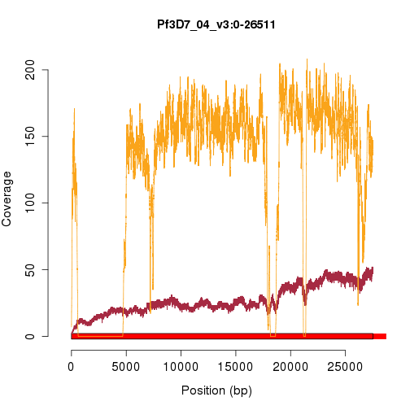
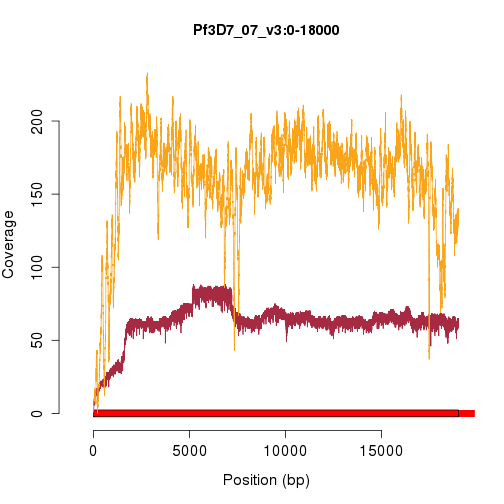
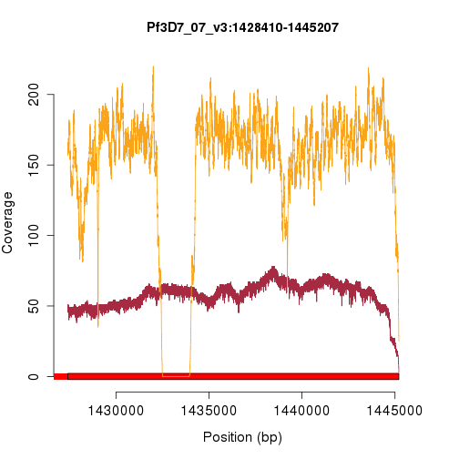
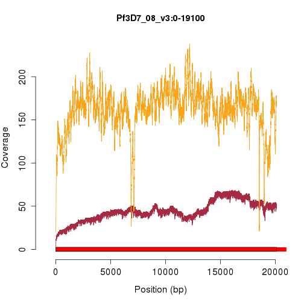
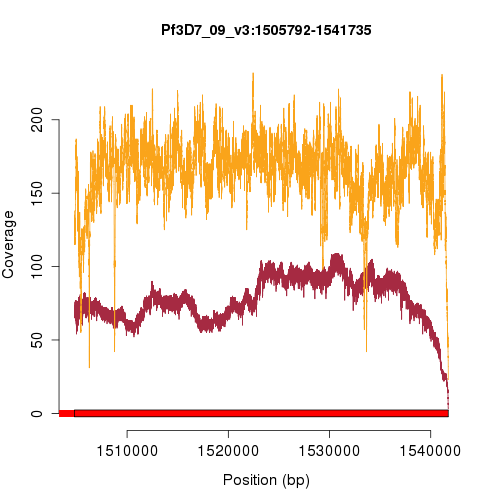
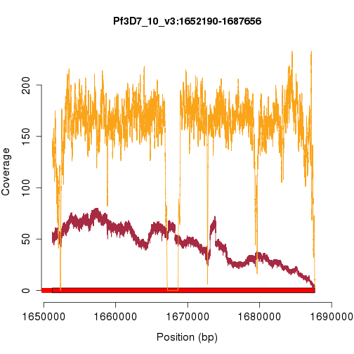
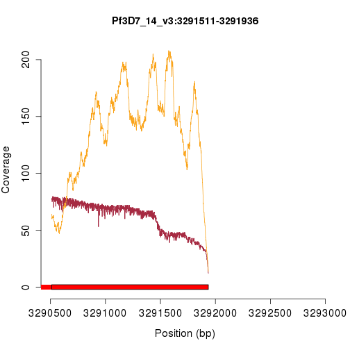
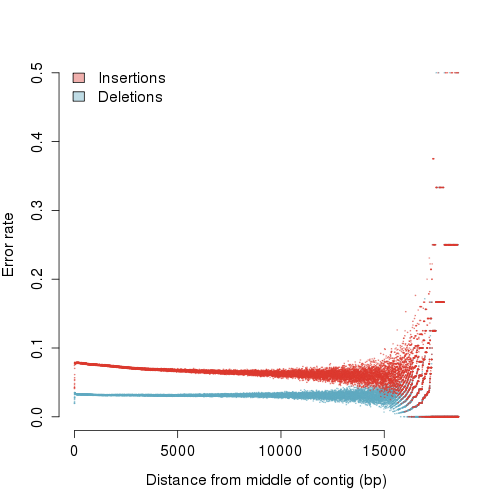

A first look at the PacBio 3D7 data
===================================


We prepared roughly 15ug of DNA from the canonical Plasmodium falciparum strain, 3D7, for sequencing on Cold Spring Harbor Laboratory's PacBio RS-II instrument.  This was sequenced on eight SMRT cells, which should yield approximately 100x coverage over the 23 megabase genome.  Having just received the filtered subreads (in unaligned and aligned form), we investigated some very basic properties of the data.

Reads, read length
==================

|key    |  numReads|  minLength|  maxLength|  meanLength|  n50Value|  alignedReads|  pctAligned|
|:------|---------:|----------:|----------:|-----------:|---------:|-------------:|-----------:|
|pb0    |     67425|         50|      35806|        6197|      9225|         60955|       90.40|
|pb1    |     63527|         50|      37335|        6593|      9707|         57739|       90.89|
|pb2    |     70147|         50|      40116|        6174|      9320|         63182|       90.07|
|pb3    |     76364|         50|      35377|        6379|      9277|         68084|       89.16|
|pb4    |     49238|         50|      33801|        5700|      8719|         45800|       93.02|
|pb5    |     36364|         50|      35002|        5503|      8490|         33104|       91.04|
|pb6    |     33385|         50|      34139|        5461|      8389|         29940|       89.68|
|pb7    |     30082|         50|      35126|        5071|      8055|         26897|       89.41|
|total  |    426532|         50|      40116|        6031|      9058|        385701|       90.43|


We first examined read count and read length properties, as shown in the table above.  We have labeled data from each SMRT cell with a simple identifier, pb0 .. pb7 (the full identifier is a bit long and cumbersome to use). On average, each SMRT cell yields 5.3316 &times; 10<sup>4</sup> reads, typically 

```

Error in base::parse(text = code, srcfile = NULL) : 
  2:0: unexpected end of input
1: mean(subset(ls, key != "total")$meanLength
   ^

```

 bases long.  Most reads (~ 90.4584) align to the reference genome.

We next examined the read length distribution, shown below.

 


 

Interestingly, this distribution appears to be bimodal, with peaks at 1.1 kb and 8.0 kb.  The origin of these peaks are unclear.  Furthermore, they appear in all SMRT cells, which could indicate a property of the library used for sequencing.  It is not clear whether this bimodality is from the original DNA sample or an artifact of the long-fragment library construction process.

Read alignment
==============

We next examined the alignment of the reads to the reference.  To guide our expectations, we compare the PacBio alignments of the long-read data to BWA alignments of short-read data Illumina data (paired-end, 76-bp, ~200 bp fragment size) from the same parasite.  However, please note that the DNA source library for these two experiments is not the same.  The Illumina data is from sample PG0051-C, the 3D7 isolate sequenced on an Illumina GA2 for the P.f. crosses project.


Strikingly, the PacBio data appears to have uniform coverage across the entire length of chromosome 1, while the Illumina data shows many peaks and valleys along the same chromosome.


 


|id        |    mean|     sd|  median|
|:---------|-------:|------:|-------:|
|PacBio    |   80.87|  14.36|      81|
|Illumina  |  118.75|  62.52|     132|


 


                            


 

