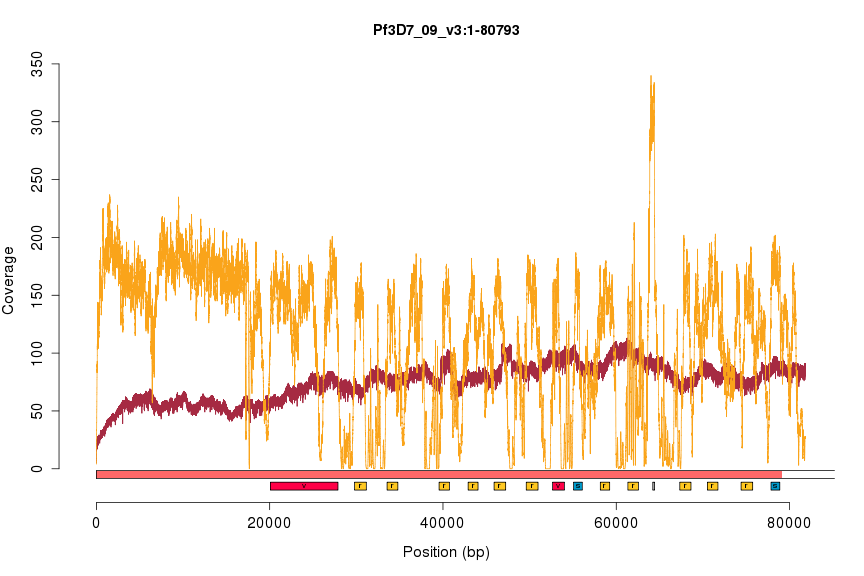

A first look at the PacBio 3D7 data
===================================


We prepared roughly 15ug of DNA from the canonical Plasmodium falciparum strain, 3D7, for sequencing on Cold Spring Harbor Laboratory's PacBio RS-II instrument.  This was sequenced on eight SMRT cells, which should yield approximately 100x coverage over the 23 megabase genome.  Having just received the filtered subreads (in unaligned and aligned form), we investigated some very basic properties of the data.

Read length
-----------

|key    |  numReads|  minLength|  maxLength|  meanLength|  n50Value|
|:------|---------:|----------:|----------:|-----------:|---------:|
|pb0    |     67425|         50|      35806|        6197|      9225|
|pb1    |     63527|         50|      37335|        6593|      9707|
|pb2    |     70147|         50|      40116|        6174|      9320|
|pb3    |     76364|         50|      35377|        6379|      9277|
|pb4    |     49238|         50|      33801|        5700|      8719|
|pb5    |     36364|         50|      35002|        5503|      8490|
|pb6    |     33385|         50|      34139|        5461|      8389|
|pb7    |     30082|         50|      35126|        5071|      8055|
|total  |    426532|         50|      40116|        6031|      9058|


We first examined read count and read length properties, as shown in the table above.  We have labeled data from each SMRT cell with a simple identifier, pb0 .. pb7 (the full identifier is a bit long and cumbersome to use everywhere). On average, each SMRT cell yields 5.3316 &times; 10<sup>4</sup> reads, typically 5884.704 +/- 527.5589 bases long.

We next examined the read length distribution, shown below.

 


Interestingly, this distribution appears to be bimodal, with peaks at 1.1 kb and 8.0 kb.  The origin of these peaks are unclear.  Furthermore, they appear in all SMRT cells (see figure below), which could indicate a property of the library used for sequencing.  It is not clear whether this bimodality is from the original DNA sample or an artifact of the long-fragment library construction process.

 


Read alignment
--------------


We next examined the alignment of the reads to the reference (as performed by CSHL using `pbalign`(?)).  To guide our expectations, we compare the PacBio alignments of the long-read data to BWA alignments of short-read data Illumina data (paired-end, 76-bp, ~200 bp fragment size) from the same parasite.  However, please note that the DNA source library for these two experiments is not the same.  The Illumina data is from sample PG0051-C, the 3D7 isolate sequenced on an Illumina GA2 for the P.f. crosses project.  The coverage metrics over the whole of chromosome 8 are listed in the table below:

|id        |  median|    mean|     sd|
|:---------|-------:|-------:|------:|
|PacBio    |      81|   80.87|  14.36|
|Illumina  |     132|  118.75|  62.52|


 


We manually inspected the alignments in IGV across the entire length of chromosome 1.


Strikingly, the PacBio data appears to have uniform coverage across the entire length of chromosome 1, while the Illumina data shows many peaks and valleys along the same chromosome.  Zooming in closer (below), we can see that the PacBio reads are replete with insertions, typically one base long, as expected.


Genome accessibility
--------------------

We sought to examine regions of the P. falciparum genome that are inaccessible with Illumina reads but accessible with PacBio reads.  We computed coverage profiles across each autosome by computing coverage at every nucleotide using the GATK's `DepthOfCoverage` tool, and showing the minimum coverage value found in 2,000-bp bins.  We've plotted the PacBio coverage above the appropriate ideogram and the Illumina coverage underneath it (and flipped upside-down) in the plot below.  Red and gray regions indicate areas of the genome deemed to be inaccessible (from Alistair Miles's accessibility calculations on MalariaGen datasets, personal communication).

 


It is evident that the PacBio coverage is roughly uniform across the entire length of the chromosome.  In contrast, the Illumina coverage spikes and dips as it moves along, reaching zero coverage in many regions (especially the biologically interesting subtelomeric repetitive regions).  Let us examine a few of these places more closely.


### Centromere on chromosome 4
 


### All 28 masked telomeric regions
                            


Error rate along the length of the read
---------------------------------------

Finally, we examined the error rate as a function of distance from the center of the contig (this is a slightly more meaningful measure for contigs, where it is easy to see error piling up towards the end of contigs, associated with the end of a graph traversal, but we have the code so we might as well look).  Here, we take a read, fold it in half, and start measuring the rate of insertion and deletion errors as a function of distance from the center of the read.  The result is shown below.  Insertion and deletion errors are found uniformly along the length of the reads.  Towards the tail end, we start to see a lot more variance in this rate as reads that reach these lengths become more infrequent.

 


AsmTest1, the first assembly attempt
------------------------------------

To construct an initial draft assembly, we ran the `RS_HGAP_Assembly.2` secondary analysis protocol available in SMRT Portal.  Briefly, this processing protocol performs the following steps:

1. Extract subreads (genomic sequence absent of the SMRT bell adaptors used to circularize the fragment and enable the polymerase to read it in multiple passes).
2. Filter out low quality subreads.
3. Compute a subread length threshold such that subreads greater than or equal to this length provide roughly 30x genome coverage.
4. Select "seed" reads based on the computed subread length threshold.
5. Map all of the filtered subreads to the seed reads using `BLASR`.
6. Determine a consensus sequence from the subread alignments to the seed reads and preassemble (i.e. error-correct) the reads.
7. Assemble the preassembled reads using the Celera overlap-consensus-layout assembler.
8. Refine the assembly by mapping all raw data to the new assembly using `BLASR` and trimming low-quality ends of contigs.
9. Improve the continuity of the assembly and remove errors using the quality-aware consensus algorithm, `Quiver`. 

With the exception of the estimated genome size parameter (which we set to 23,000,000 bp), we left all default settings in this protocol unchanged.  Basic metrics on the resulting assembly, hereafter referred to as "AsmTest1", are presented in the table below.  For comparison, we have also provided metrics on every *P. falciparum* assembly currently available.

|id        |  numContigs|  minLength|  maxLength|  meanLength|      n50|  totalSequence|
|:---------|-----------:|----------:|----------:|-----------:|--------:|--------------:|
|3D7       |          16|       5967|    3291936|     1458302|  1687656|       23332831|
|AsmTest1  |          34|      11443|    3293905|      697875|  1696391|       23727741|
|IT        |          56|        580|    3219929|      409892|  1570953|       22953932|
|IGH-CR14  |         849|       2199|     120285|       25608|    37016|       21741172|
|HB3       |        1189|        201|     377975|       20402|    96469|       24258511|
|RAJ116    |        1199|       2042|      70306|       11765|    12998|       14106529|
|DD2       |        2837|        201|     102309|        7358|    19112|       20875591|
|V34.04    |        4329|        226|      16341|        3059|     3756|       13240777|
|D10       |        4471|        259|      19127|        2992|     3707|       13375079|
|K1        |        4772|        231|      18390|        2785|     3422|       13290906|
|7G8       |        4843|        204|      19000|        2948|     3832|       14278891|
|FCC-2     |        4956|        200|      17581|        2616|     3302|       12963854|
|RO-33     |        4991|        208|      19991|        2748|     3473|       13714138|
|D6        |        5011|        266|      15451|        2638|     3231|       13216528|
|SL        |        5193|        214|      55682|        2540|     3079|       13192745|
|VS.1      |        5856|        201|      22989|        3225|     4424|       18887633|
|PFCLIN    |       18711|       1001|      33813|        2366|     2992|       44265486|


The AsmTest1 assembly compares quite favorably to the best assemblies, with 34 compared to 3D7's 16 and IT's 56.  The longest chromosome in the *P. falciparum* genome is chromosome 14 (3291936 bp).  The longest contig in the AsmTest1 assembly appears roughly this length, suggesting that we may have assemblied the majority (or the entirety) of chromosome 14 in a single contig.

Comparison to canonical genome, 3D7
-----------------------------------


We compared AsmTest1 to the 3D7 canonical genome by performing an all-by-all (contigs vs. chromosomes) alignment with `MUMmer`.  Short, spurious alignments were filtered out.  The results are presented in the table below.  The near-entirety of chromosome 14 is assembled into a single contig.  On average, each chromosome is assembled into 4.4667 +/- 3.7391 contigs.  Each chromosome seems to be more-or-less fully recovered (note that the % coverage will add up to more than 100% in some cases as contigs may overlap slightly).

One strange finding from the table below is the observation that a few contigs contain a lot more content than the reference genome.  For instance, the mitochondrial genome, M76611, is 5967 bp long.  This is 100% contained by the scf7180000000116 contig.  Yet, the alignment starts at position 3868, and only represents 13.74% of its sequence.  This is probably due to the fact that the mitochondrial chromosome is circular, and the read length is substantially longer than the chromosome.  Hence, we've likely picked up several copies of it, and they've all been concatenated together into a single contig.  Errors or microheteroplasmy may explain why these repeats do not get collapsed into a single contig of the expected size.

|REF          |QUERY             |       S1|       E1|       S2|       E2|   COV_R|   COV_Q|
|:------------|:-----------------|--------:|--------:|--------:|--------:|-------:|-------:|
|M76611       |scf7180000000116  |        1|     5967|     3868|     9834|  100.00|   13.74|
|Pf3D7_01_v3  |scf7180000000096  |        3|    39095|     5347|    44519|    6.10|   86.90|
|Pf3D7_01_v3  |scf7180000000113  |    26627|   313647|        1|   287313|   44.79|   46.70|
|Pf3D7_01_v3  |scf7180000000113  |   313611|   640851|   287483|   614871|   51.06|   53.21|
|Pf3D7_02_v3  |scf7180000000110  |     1465|   947100|        1|   944392|   99.85|   99.90|
|Pf3D7_02_v3  |scf7180000000091  |   946546|   947102|       90|      651|    0.06|    0.02|
|Pf3D7_03_v3  |scf7180000000108  |     2077|  1063160|        2|  1061347|   99.36|  100.00|
|Pf3D7_03_v3  |scf7180000000091  |  1063232|  1063882|      393|     1040|    0.06|    0.02|
|Pf3D7_03_v3  |scf7180000000110  |  1063772|  1065269|   943840|   945340|    0.14|    0.16|
|Pf3D7_03_v3  |scf7180000000105  |  1064820|  1065596|        1|      784|    0.07|    0.05|
|Pf3D7_03_v3  |scf7180000000102  |  1065611|  1065841|  1320645|  1320876|    0.02|    0.02|
|Pf3D7_03_v3  |scf7180000000090  |  1066010|  1066830|  3293080|  3293905|    0.08|    0.03|
|Pf3D7_04_v3  |scf7180000000121  |        1|   379999|      731|   380097|   31.65|   39.16|
|Pf3D7_04_v3  |scf7180000000121  |   379839|   587301|   380192|   587781|   17.28|   21.43|
|Pf3D7_04_v3  |scf7180000000121  |   587292|   961405|   587917|   962088|   31.16|   38.63|
|Pf3D7_04_v3  |scf7180000000123  |   946163|   962879|        1|    16711|    1.39|   64.04|
|Pf3D7_04_v3  |scf7180000000122  |   962849|  1200488|    23394|   261857|   19.80|   91.05|
|Pf3D7_05_v3  |scf7180000000107  |    12341|  1104063|     5299|  1097830|   81.26|   81.57|
|Pf3D7_05_v3  |scf7180000000107  |  1103711|  1332679|  1097886|  1326910|   17.04|   17.10|
|Pf3D7_05_v3  |scf7180000000107  |  1332488|  1343557|  1327077|  1338180|    0.82|    0.83|
|Pf3D7_06_v3  |scf7180000000102  |        3|    59608|  1260092|  1319754|    4.20|    4.52|
|Pf3D7_06_v3  |scf7180000000102  |    59608|   858954|   459639|  1259331|   56.36|   60.54|
|Pf3D7_06_v3  |scf7180000000102  |   858698|  1318229|        1|   459631|   32.40|   34.80|
|Pf3D7_06_v3  |scf7180000000097  |  1310157|  1418240|      525|   108657|    7.62|    5.55|
|Pf3D7_07_v3  |scf7180000000106  |      111|    71658|        1|    71472|    4.95|   99.99|
|Pf3D7_07_v3  |scf7180000000104  |    59901|  1444792|        1|  1400860|   95.83|  100.00|
|Pf3D7_07_v3  |scf7180000000096  |  1444713|  1445205|    44370|    44865|    0.03|    1.10|
|Pf3D7_08_v3  |scf7180000000105  |        1|   460322|     1624|   462086|   31.25|   30.81|
|Pf3D7_08_v3  |scf7180000000105  |   443167|  1472805|   463696|  1493537|   69.91|   68.92|
|Pf3D7_09_v3  |scf7180000000118  |        4|  1483635|     1265|  1485303|   96.23|   99.91|
|Pf3D7_09_v3  |scf7180000000119  |  1466769|  1505606|        1|    38801|    2.52|  100.00|
|Pf3D7_09_v3  |scf7180000000120  |  1493354|  1541735|        1|    48394|    3.14|   98.07|
|Pf3D7_10_v3  |scf7180000000099  |        1|   899716|      526|   900953|   53.31|   53.08|
|Pf3D7_10_v3  |scf7180000000099  |   899565|   936722|   900991|   938160|    2.20|    2.19|
|Pf3D7_10_v3  |scf7180000000099  |   936607|  1438085|   940321|  1441932|   29.71|   29.57|
|Pf3D7_10_v3  |scf7180000000099  |  1436757|  1546357|  1442382|  1552102|    6.49|    6.47|
|Pf3D7_10_v3  |scf7180000000099  |  1543910|  1584566|  1553786|  1595087|    2.41|    2.43|
|Pf3D7_10_v3  |scf7180000000099  |  1584690|  1672530|  1595210|  1696279|    5.20|    5.96|
|Pf3D7_10_v3  |scf7180000000100  |  1659128|  1686332|        1|    27224|    1.61|  100.00|
|Pf3D7_10_v3  |scf7180000000122  |  1686821|  1687129|   261596|   261895|    0.02|    0.11|
|Pf3D7_11_v3  |scf7180000000091  |        1|      811|      682|     1479|    0.04|    0.03|
|Pf3D7_11_v3  |scf7180000000098  |      814|    87429|        1|    86664|    4.25|   98.89|
|Pf3D7_11_v3  |scf7180000000097  |    76816|  1932717|    90878|  1947480|   91.05|   95.33|
|Pf3D7_11_v3  |scf7180000000091  |  1918006|  2038337|  2799800|  2920153|    5.90|    4.12|
|Pf3D7_12_v3  |scf7180000000092  |        1|   497672|      870|   498698|   21.91|   21.55|
|Pf3D7_12_v3  |scf7180000000092  |   497593|   976053|   498759|   977553|   21.06|   20.73|
|Pf3D7_12_v3  |scf7180000000092  |   974230|  1030827|   981025|  1037622|    2.49|    2.45|
|Pf3D7_12_v3  |scf7180000000092  |  1031055|  1510206|  1037523|  1516966|   21.09|   20.76|
|Pf3D7_12_v3  |scf7180000000092  |  1510147|  1723147|  1516984|  1730017|    9.38|    9.22|
|Pf3D7_12_v3  |scf7180000000092  |  1707530|  2271389|  1745542|  2309609|   24.82|   24.42|
|Pf3D7_13_v3  |scf7180000000091  |        1|  1547426|     1432|  1549862|   52.90|   53.01|
|Pf3D7_13_v3  |scf7180000000091  |  1547233|  2211516|  1550332|  2214838|   22.71|   22.75|
|Pf3D7_13_v3  |scf7180000000091  |  2211575|  2211646|  2216968|  2217038|    0.00|    0.00|
|Pf3D7_13_v3  |scf7180000000091  |  2211612|  2212190|  2216385|  2216966|    0.02|    0.02|
|Pf3D7_13_v3  |scf7180000000091  |  2212189|  2212274|  2217003|  2217089|    0.00|    0.00|
|Pf3D7_13_v3  |scf7180000000091  |  2212297|  2328325|  2218035|  2334091|    3.97|    3.97|
|Pf3D7_13_v3  |scf7180000000091  |  2328302|  2495387|  2335084|  2502176|    5.71|    5.72|
|Pf3D7_13_v3  |scf7180000000091  |  2495388|  2561560|  2502326|  2568544|    2.26|    2.27|
|Pf3D7_13_v3  |scf7180000000091  |  2562118|  2672689|  2569784|  2680392|    3.78|    3.79|
|Pf3D7_13_v3  |scf7180000000091  |  2672690|  2672861|  2681292|  2681463|    0.01|    0.01|
|Pf3D7_13_v3  |scf7180000000091  |  2672850|  2672982|  2680436|  2680569|    0.00|    0.00|
|Pf3D7_13_v3  |scf7180000000091  |  2672939|  2673345|  2681323|  2681732|    0.01|    0.01|
|Pf3D7_13_v3  |scf7180000000091  |  2673331|  2673527|  2680590|  2680787|    0.01|    0.01|
|Pf3D7_13_v3  |scf7180000000091  |  2674506|  2807398|  2682267|  2815198|    4.54|    4.55|
|Pf3D7_13_v3  |scf7180000000095  |  2795392|  2903479|        1|   108907|    3.70|  100.00|
|Pf3D7_13_v3  |scf7180000000117  |  2908643|  2921615|        1|    13054|    0.44|  100.00|
|Pf3D7_14_v3  |scf7180000000090  |        1|  3291936|      391|  3293241|  100.00|   99.97|


Visualization as dotplot
------------------------

We visualized these alignments as a multi-dot plot.  Nearly all of the assembly content lines up with the canonical assembly (as evidenced from the bulk of the data adhering approximately to the f(x) = x line).  Occassional spurious points do exist, likely due to some repetitive homologous regions among chromosomes.

 


Errors in the assembly
----------------------

As we have sequenced DNA from the 3D7 parasite, any differences should likely reflect errors in the sequence.  We therefore called SNPs between the two assemblies to find these errors.  The sums are presented in the table below, as well as the percent of bases per chromosome these errors represent.

|id           |SNP           |INS            |DEL           |
|:------------|:-------------|:--------------|:-------------|
|Pf3D7_01_v3  |119 (0.02%)   |763 (0.12%)    |291 (0.05%)   |
|Pf3D7_02_v3  |164 (0.02%)   |475 (0.05%)    |162 (0.02%)   |
|Pf3D7_03_v3  |272 (0.03%)   |523 (0.05%)    |290 (0.03%)   |
|Pf3D7_04_v3  |141 (0.01%)   |856 (0.07%)    |713 (0.06%)   |
|Pf3D7_05_v3  |111 (0.01%)   |531 (0.04%)    |175 (0.01%)   |
|Pf3D7_06_v3  |504 (0.04%)   |731 (0.05%)    |180 (0.01%)   |
|Pf3D7_07_v3  |194 (0.01%)   |609 (0.04%)    |320 (0.02%)   |
|Pf3D7_08_v3  |134 (0.01%)   |597 (0.04%)    |251 (0.02%)   |
|Pf3D7_09_v3  |61 (0.00%)    |713 (0.05%)    |259 (0.02%)   |
|Pf3D7_10_v3  |732 (0.04%)   |810 (0.05%)    |308 (0.02%)   |
|Pf3D7_11_v3  |310 (0.02%)   |1008 (0.05%)   |459 (0.02%)   |
|Pf3D7_12_v3  |232 (0.01%)   |1202 (0.05%)   |390 (0.02%)   |
|Pf3D7_13_v3  |231 (0.01%)   |1493 (0.05%)   |409 (0.01%)   |
|Pf3D7_14_v3  |152 (0.00%)   |1309 (0.04%)   |396 (0.01%)   |
|             |3357 (0.03%)  |11620 (0.10%)  |4603 (0.04%)  |


Overall, the SNP, insertion, and deletion rates are exceedingly low: amounting to 19580 events in a 23 megabase genome (0.1678%).  The insertion rate is much higher than that of deletions and SNPs, perhaps due to the insertion error mode of the PacBio sequencing instrument.  All chromosomes appear reasonably similar in performance.

Recovery of the *var* repertoire
--------------------------------

|geneName       |contig            |    start|  NM|  NI|  ND|CIGAR                                                 |
|:--------------|:-----------------|--------:|---:|---:|---:|:-----------------------------------------------------|
|PF3D7_0100100  |scf7180000000113  |     2889|   0|   0|   0|7617M                                                 |
|PF3D7_0100300  |scf7180000000113  |    15746|   0|   0|   0|4141M                                                 |
|PF3D7_0115700  |scf7180000000113  |   581404|   1|   0|   1|1655M1D5849M                                          |
|PF3D7_0200100  |scf7180000000110  |    23774|   2|   2|   0|4187M1I47M1I1701M                                     |
|PF3D7_0223500  |scf7180000000110  |   913660|   5|   4|   1|1409M1I22M1I116M1I220M1I31M1D5495M                    |
|PF3D7_0300100  |scf7180000000108  |  1018947|   0|   0|   0|7518M                                                 |
|PF3D7_0324900  |scf7180000000108  |    24903|   2|   1|   1|5425M1D418M1I1589M                                    |
|PF3D7_0400100  |scf7180000000121  |    29103|   2|   2|   0|7025M1I89M1I1856M                                     |
|PF3D7_0400400  |scf7180000000121  |    45947|   3|   2|   1|1488M1I99M1I7202M1D2515M                              |
|PF3D7_0412400  |scf7180000000121  |   546434|   4|   1|   2|1423M1D609M1D71M2I5719M                               |
|PF3D7_0412700  |scf7180000000121  |   562113|   1|   0|   1|7048M1D628M                                           |
|PF3D7_0412900  |scf7180000000121  |   577257|   4|   3|   1|1744M1I154M1I105M1I5243M1D610M                        |
|PF3D7_0413100  |scf7180000000121  |   592583|   0|   0|   0|7901M                                                 |
|PF3D7_0420700  |scf7180000000121  |   935742|   1|   1|   0|1531M1I5313M                                          |
|PF3D7_0420900  |scf7180000000123  |    11900|   2|   1|   1|1953M1I4643M1D1008M                                   |
|PF3D7_0421100  |scf7180000000122  |     7733|   2|   1|   1|1748M1I16M1D5780M                                     |
|PF3D7_0421300  |scf7180000000122  |    29576|   2|   2|   0|1671M1I326M1I5562M                                    |
|PF3D7_0425800  |scf7180000000122  |   217801|   0|   0|   0|11399M                                                |
|PF3D7_0426000  |scf7180000000122  |   234430|   0|   0|   0|7174M                                                 |
|PF3D7_0500100  |scf7180000000107  |    13858|   4|   2|   0|5777M2I55M1I1693M                                     |
|PF3D7_0533100  |scf7180000000107  |  1328058|   0|   0|   0|9495M                                                 |
|PF3D7_0600200  |scf7180000000102  |  1306876|   1|   1|   0|1475M1I7857M                                          |
|PF3D7_0600400  |scf7180000000102  |  1296989|   0|   0|   0|4136M                                                 |
|PF3D7_0617400  |scf7180000000102  |   587149|   0|   0|   0|8374M                                                 |
|PF3D7_0632500  |scf7180000000097  |    52370|   0|   0|   0|12485M                                                |
|PF3D7_0632800  |scf7180000000097  |    36171|   1|   1|   0|5870M1I1960M                                          |
|PF3D7_0700100  |scf7180000000106  |    43524|   3|   1|   1|1765M2D306M1I5705M                                    |
|PF3D7_0711700  |scf7180000000104  |   941248|   0|   0|   0|7476M                                                 |
|PF3D7_0712000  |scf7180000000104  |   925540|   1|   0|   1|5653M1D2141M                                          |
|PF3D7_0712300  |scf7180000000104  |   894486|   1|   0|   1|584M1D7031M                                           |
|PF3D7_0712400  |scf7180000000104  |   885927|   0|   0|   0|6921M                                                 |
|PF3D7_0712600  |scf7180000000104  |   870697|   0|   0|   0|7583M                                                 |
|PF3D7_0712800  |scf7180000000104  |   856081|   0|   0|   0|7538M                                                 |
|PF3D7_0712900  |scf7180000000104  |   847272|   1|   1|   0|5926M1I1481M                                          |
|PF3D7_0733000  |scf7180000000104  |    18566|   3|   3|   0|6797M1I36M1I25M1I1786M                                |
|PF3D7_0800100  |scf7180000000105  |    22999|   1|   1|   0|5695M1I1597M                                          |
|PF3D7_0800200  |scf7180000000105  |    31337|   0|   0|   0|9334M                                                 |
|PF3D7_0800300  |scf7180000000105  |    42585|   1|   1|   0|8227M1I1764M                                          |
|PF3D7_0808600  |scf7180000000105  |   432928|   0|   0|   0|7887M                                                 |
|PF3D7_0808700  |scf7180000000105  |   442171|   1|   0|   1|5845M1D1810M                                          |
|PF3D7_0809100  |scf7180000000105  |   479875|   1|   1|   0|5738M1I1517M                                          |
|PF3D7_0833500  |scf7180000000105  |  1456528|   1|   0|   1|1870M1D5786M                                          |
|PF3D7_0900100  |scf7180000000118  |    21355|   2|   0|   1|5634M2D2172M                                          |
|PF3D7_0937600  |scf7180000000119  |    19292|   0|   0|   0|4118M                                                 |
|PF3D7_0937800  |scf7180000000120  |     2225|   6|   3|   1|508M1D1455M1I131M1I45M1I5616M                         |
|PF3D7_1000100  |scf7180000000099  |    29010|   0|   0|   0|7675M                                                 |
|PF3D7_1041300  |scf7180000000099  |  1666163|   1|   1|   0|1986M1I5561M                                          |
|PF3D7_1100100  |scf7180000000098  |    55846|   2|   2|   0|1496M1I162M1I5779M                                    |
|PF3D7_1100200  |scf7180000000098  |    45058|   2|   1|   1|8001M1D211M1I1508M                                    |
|PF3D7_1150400  |scf7180000000091  |  2907612|   1|   0|   1|8263M1D1807M                                          |
|PF3D7_1200100  |scf7180000000092  |    17854|   4|   0|   2|5331M2D51M2D2143M                                     |
|PF3D7_1200400  |scf7180000000092  |    33589|   1|   1|   0|7745M1I1492M                                          |
|PF3D7_1200600  |scf7180000000092  |    47672|   1|   1|   0|1626M1I8391M                                          |
|PF3D7_1219300  |scf7180000000092  |   768052|   4|   1|   2|1725M1I130M2D56M1D5632M                               |
|PF3D7_1240300  |scf7180000000092  |  1701053|   3|   2|   1|6877M1D192M1I287M1I1580M                              |
|PF3D7_1240400  |scf7180000000092  |  1711414|   2|   1|   1|5667M1D504M1I1807M                                    |
|PF3D7_1240600  |scf7180000000092  |  1757581|   3|   1|   0|1840M3I6040M                                          |
|PF3D7_1240900  |scf7180000000092  |  1773547|   0|   0|   0|7866M                                                 |
|PF3D7_1255200  |scf7180000000092  |  2279481|   5|   2|   1|1479M1I452M1I2653M3D3106M                             |
|PF3D7_1300100  |scf7180000000091  |    22863|   0|   0|   0|7424M                                                 |
|PF3D7_1300300  |scf7180000000091  |    35456|   0|   0|   0|10784M                                                |
|PF3D7_1373500  |scf7180000000095  |    90223|  13|   9|   0|1626M1I28M1I71M1I35M1I54M2I37M1I10M1I70M2I89M1I5524M  |


We examined the recovery of the 62 members of the *var* gene family by aligning their full-length genomic sequences (exons and introns) to the AsmTest1 assembly using `bwa mem`.  All 62 *var* genes were successfully aligned to the assembly (all had mapping quality greater than 0; only 1 had mapping quality less than 60).  Information on each alignment is shown in the table above (NM, NI, and ND columns represent the numbers of mismatches, insertions, and deletions observed, respectively).  21 were found to map with 100% identity.  The remaining have, on average, 2.4634 mismatches, 1.3902 insertions, and 0.6341 deletions.  The overwhelming majority of indels are a single nucleotide in length.


It seemed likely that many of these errors occur in intronic regions where high repetitive sequence content might contribute to misassembly.  We investigated this hypothesis by aligning the exons of the var genes separately and enumerating errors observed in exons and introns.  We ignored 11 genes with poor exon alignments (i.e. with mapping quality less than 10).  The results are presented in the table below.  91.7808% of the errors are found in intronic regions.  Exon 2 of the *var* gene (the short exon) is base-for-base perfect when compared to the canonical reference.

|id            |  total|  intron|  exon1|  exon2|
|:-------------|------:|-------:|------:|------:|
|all           |    146|     134|     12|      0|
|- mismatches  |     81|      73|      8|      0|
|- insertions  |     46|      45|      1|      0|
|- deletions   |     19|      16|      3|      0|


Further polishing with Illumina data
------------------------------------

As we have additional Illumina data for this sample, we were curious to see if it could be leveraged to correct some of the errors in the assembly.  To that end, we devised a basic correction pipeline based on the premise any variants found by aligning the same sample's Illumina data to the PacBio-based assembly would constitute errors in the assembly.

1. Aligned the Illumina reads from sample PG0051-C to the AsmTest1 assembly (`bwa`).
2. Mark duplicate reads (`Picard MarkDuplicates`).
3. Perform local realignment near putative indels (`GATK`).
4. Recalibrate base quality scores (`GATK`).
5. Call SNPs and indels (`GATK`).
6. Filter SNPs and indels (`GATK`).
7. Modify the assembly by incorporating the alternate allele from filtered variants (`GATK`).

The table below presents error counts within *var* genes for the unpolished and polished assemblies. 


|id            |  total|  intron|  exon1|  exon2|
|:-------------|------:|-------:|------:|------:|
|unpolished    |    146|     134|     12|      0|
|- mismatches  |     81|      73|      8|      0|
|- insertions  |     46|      45|      1|      0|
|- deletions   |     19|      16|      3|      0|
|polished      |     90|      84|      6|      0|
|- mismatches  |     53|      49|      4|      0|
|- insertions  |     25|      24|      1|      0|
|- deletions   |     12|      11|      1|      0|


There is evidently an improvement in the error rate within the *var* genes.  After polishing, the number of perfectly reconstructed *var* genes increases from 21 to 32.  This should improve when we get better Illumina data (the data used for polishing is 76-bp, paired-end data sequenced on an Illumina GA2).

|id           |SNP (u)       |SNP (p)       |INS (u)        |INS (p)        |DEL (u)       |DEL (p)       |
|:------------|:-------------|:-------------|:--------------|:--------------|:-------------|:-------------|
|Pf3D7_01_v3  |119 (0.02%)   |127 (0.02%)   |763 (0.12%)    |728 (0.11%)    |291 (0.05%)   |276 (0.04%)   |
|Pf3D7_02_v3  |164 (0.02%)   |179 (0.02%)   |475 (0.05%)    |410 (0.04%)    |162 (0.02%)   |117 (0.01%)   |
|Pf3D7_03_v3  |272 (0.03%)   |323 (0.03%)   |523 (0.05%)    |489 (0.05%)    |290 (0.03%)   |281 (0.03%)   |
|Pf3D7_04_v3  |141 (0.01%)   |160 (0.01%)   |856 (0.07%)    |794 (0.07%)    |713 (0.06%)   |595 (0.05%)   |
|Pf3D7_05_v3  |111 (0.01%)   |138 (0.01%)   |531 (0.04%)    |452 (0.03%)    |175 (0.01%)   |165 (0.01%)   |
|Pf3D7_06_v3  |504 (0.04%)   |517 (0.04%)   |731 (0.05%)    |648 (0.05%)    |180 (0.01%)   |169 (0.01%)   |
|Pf3D7_07_v3  |194 (0.01%)   |208 (0.01%)   |609 (0.04%)    |531 (0.04%)    |320 (0.02%)   |289 (0.02%)   |
|Pf3D7_08_v3  |134 (0.01%)   |145 (0.01%)   |597 (0.04%)    |524 (0.04%)    |251 (0.02%)   |209 (0.01%)   |
|Pf3D7_09_v3  |61 (0.00%)    |84 (0.01%)    |713 (0.05%)    |622 (0.04%)    |259 (0.02%)   |212 (0.01%)   |
|Pf3D7_10_v3  |732 (0.04%)   |742 (0.04%)   |810 (0.05%)    |715 (0.04%)    |308 (0.02%)   |251 (0.01%)   |
|Pf3D7_11_v3  |310 (0.02%)   |310 (0.02%)   |1008 (0.05%)   |869 (0.04%)    |459 (0.02%)   |412 (0.02%)   |
|Pf3D7_12_v3  |232 (0.01%)   |265 (0.01%)   |1202 (0.05%)   |1066 (0.05%)   |390 (0.02%)   |332 (0.01%)   |
|Pf3D7_13_v3  |231 (0.01%)   |294 (0.01%)   |1493 (0.05%)   |1283 (0.04%)   |409 (0.01%)   |371 (0.01%)   |
|Pf3D7_14_v3  |152 (0.00%)   |215 (0.01%)   |1309 (0.04%)   |1114 (0.03%)   |396 (0.01%)   |189 (0.01%)   |
|             |3357 (0.03%)  |3707 (0.03%)  |11620 (0.10%)  |10245 (0.09%)  |4603 (0.04%)  |3868 (0.03%)  |


Overall, polishing does reduce the number of insertion and deletion errors in the assembly.  However, the number of apparent SNPs has increased from 3357 (0.03%) to 3707 (0.03%). When we examine some of these SNPs in IGV, it is apparent that they are dominated by errors in homopolymer regions.  In the next iteration of the polishing pipeline, we should either be much more aggressive in filtering out false-positives from these regions, or we should simply not attempt to correct single base mismatches at all.

Acknowledgements
----------------

Thanks to Kwiatkowski lab members:

* Susana Campino, Mihir Kekre, Eleanor Drury for their work on culturing the 3D7 parasite to the necessary level in order to extract the requisite amount of genomic DNA for PacBio sequencing.
* Alistair Miles for the P. falciparum genome accessibility calculations and other useful discussions.
* Dawn Muddyman and Claire Nathwani for administrative support.
* Dominic Kwiatkowski for access to data and collaboration.

Thanks to CSHL Pacific Biosciences Sequencing Service:

* Senem Mavruk Eskipehlivan: Technician, PacBio sequencer operation
* Elena Ghiban: Bioinformatic staff, PacBio server management
* Melissa deBastide: Lead bioinformatics of the genome center
* Patricia Mocombe: Technician, PacBio sequencing library construction
* Stephanie Muller: Technician, responsible for receiving samples and archiving metadata into LIMS
* Maureen Bell: Financial officer
* Eric Antoniou: research investigator and operation manager of the genome center
* Michael Schatz: Associate Professor, de novo assembly using PacBio reads

Thanks to McVean lab members:

* Isaac Turner for discussions on generating and validating *de novo* assemblies.
* Gil McVean for PhD advising

Session info
------------


```r
sessionInfo()
```

```
## R version 3.1.0 (2014-04-10)
## Platform: x86_64-unknown-linux-gnu (64-bit)
## 
## locale:
##  [1] LC_CTYPE=en_GB.UTF-8       LC_NUMERIC=C              
##  [3] LC_TIME=en_GB.UTF-8        LC_COLLATE=en_GB.UTF-8    
##  [5] LC_MONETARY=en_GB.UTF-8    LC_MESSAGES=en_GB.UTF-8   
##  [7] LC_PAPER=en_GB.UTF-8       LC_NAME=C                 
##  [9] LC_ADDRESS=C               LC_TELEPHONE=C            
## [11] LC_MEASUREMENT=en_GB.UTF-8 LC_IDENTIFICATION=C       
## 
## attached base packages:
## [1] stats     graphics  grDevices utils     datasets  methods   base     
## 
## other attached packages:
## [1] knitr_1.5
## 
## loaded via a namespace (and not attached):
## [1] digest_0.6.4   evaluate_0.5.5 formatR_0.10   stringr_0.6.2 
## [5] tools_3.1.0
```

