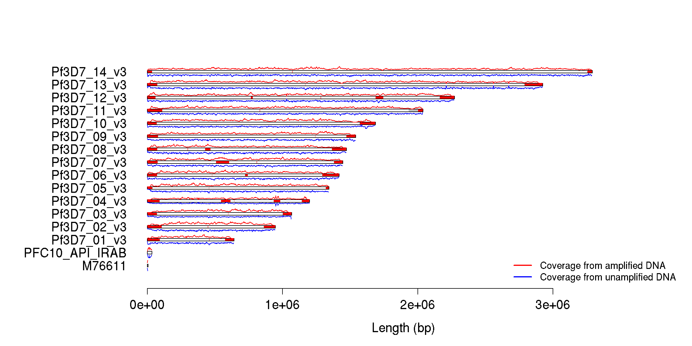

# Whole-genome amplification lowers the barrier to entry for long-read sequencing

## Introduction

Long-read sequencing instruments routinely produce reads around 10-20 kb in length with sufficiently low error rate as to produce inexpensive draft quality reference sequences.  However, a significant impediment to carrying out these sequencing experiments remains the high input gDNA requirement.  Pacific Biosciences recommends 10-15 ug of high molecular weight gDNA for libraries with a 10-20 kb insert size.  This is 3-4 orders of magnitude larger than required for Illumina sequencing.  Such a large quantity of gDNA can be difficult to produce, and for malaria parasites, presents several obstacles.  First, parasites must be cultured, and not all parasites are equally amenable to culturing.  Second, for the parasites that *do* respond favorably to laboratory culturing conditions, they still take several months to grow.  That is a lot of opportunity for error, including cross-contamination.  Third, should the parasites be cultured successfully and DNA extracted, the library construction process itself may fail, thus rendering the months of work to produce the parasites in the first place useless.  Finally, culturing parasites for so long occupies a significant amount of time for the personnel assigned to the task, limiting the number of cultures that can be done in parallel and diminishing the overall productivity of the lab.

In order to alleviate the enormous burden posed by preparation for long-read sequencing and enable the study of high diversity regions in hundreds of draft-quality parasite assemblies, we investigated the use of whole-genome amplification (WGA) to preparing the input material.  We chose to evaluate the method on the 3D7 parasite (as a finished reference genome already exists for this sample, quality comparisons will be straightforward).  We applied a multiple displacement amplification (MDA) protocol, previously described and optimized for the AT-rich *P. falciparum* genome ().  MDA makes use of the phi-29 polymerase which has high replication fidelity and can produce 40-50 kb amplicons.

Finally, to guide some of our expectations regarding the metrics to be presented below, we also provide results from our 3D7 PacBio resequencing experiment on unamplified DNA from last year.  Note that this sample was sequenced on an older version of the chemistry (P5-C3), which produces shorter reads than the more recent (P6-C4) chemistry.


## Read lengths and coverage

We obtained DNA from the canonical reference malaria parasite, 3D7, and amplified 1 ng of material to 15 ug using the MDA protocol described above.  We submitted this material to the PacBio sequencing service at CSHL.  After construction of a 20-kb insert library and sequencing with the most recent P6-C4 chemistry, CSHL provided us with 11 SMRT cells of data.  We computed read length distributions and coverage per SMRT cell (as determined by aligning the filtered subreads with `bwa mem -x pacbio` and the `GATK DepthOfCoverage` tool), summarized in the table below.


|key            | numReads| maxLength| n50Value| cov_Q1| cov_median| cov_Q3| pct_bases_above_15x|
|:--------------|--------:|---------:|--------:|------:|----------:|------:|-------------------:|
|3D7_CSHL_A01   |    46946|     38351|    13685|     11|         16|     20|                50.4|
|3D7_CSHL_C01   |    49256|     44451|    14412|     12|         18|     23|                60.1|
|3D7_CSHL_D01   |    40379|     42929|    14128|      9|         12|     16|                28.8|
|3D7_PacBio_A01 |    63785|     40660|    14767|     13|         19|     25|                65.1|
|3D7_PacBio_B01 |    71630|     43816|    14851|     14|         20|     27|                69.6|
|3D7_PacBio_C01 |    89314|     47379|    15354|     15|         21|     28|                73.6|
|3D7_PacBio_D01 |    91311|     48366|    15334|     17|         24|     31|                79.7|
|3D7_PacBio_E01 |    94691|     45388|    14274|     18|         25|     32|                83.8|
|3D7_PacBio_F01 |    85031|     45460|    14368|     18|         25|     34|                84.4|
|3D7_PacBio_G01 |    47916|     43162|    14460|      8|         11|     14|                18.8|
|3D7_PacBio_H01 |    68161|     44561|    14452|     10|         14|     18|                41.0|

On average, the yield from each SMRT cell was 6.8038182 &times; 10<sup>4</sup> +/- 1.9979995 &times; 10<sup>4</sup> reads, resulting in about 18.6363636 +/- 4.9854333 fold coverage per cell.  Read length was consistently high with N50s around 1.4553182 &times; 10<sup>4</sup>.  SMRT cells labelled "PacBio_{A,B,C,D}01" were run with 30-minute movie lengths, while cells labelled "PacBio_{E,F,G,H}01" were run with 240-minute movie lengths.  While this should theoretically result in the latter cells having longer read lengths and higher yield, from the table it is not immediately apparent that this is the case.

The length distributions for each experiment (plotted below) reveal mostly consistent performance from SMRT cell to SMRT cell.

 


```
## Warning in file(con, "r"): cannot open file
## '../../data/data/WGAFullTest1.polished_assembly.fasta': No such file or
## directory
```

```
## Error in file(con, "r"): cannot open the connection
```


## Coverage across genome

We evaluated coverage across the genome in the aggregated set of 11 SMRT cells from amplified DNA and compared to the results obtained from our .  Coverage is more-or-less consistent across the genome, but in some cases, coverage does drop out in the centromere or the extreme telomeric ends of the chromosome (see chromosomes 6 and 12 for example).  This does have a minor effect on *var* gene recovery, as we will see later in this analysis. 


```
## Warning: NAs introduced by coercion
```

```
## Warning: NAs introduced by coercion
```

 

## Assembly performance

We produced four assemblies with the amplified DNA: one with eleven SMRT cells ("amplified"), one with the four 30-minute SMRT cells ("WGA4Cells_30m"), one with the four 4-hour SMRT cells ("WGA4Cells_4h"), and one with the three CSHL SMRT cells ("WGA3Cells_CSHL").  We compared the performance of these assemblies to existing finished and draft sequences, as well as our PacBio test from last year ("unamplified").  The results are presented in the table below.  Interestingly, the four SMRT cell tests yielded comparable results to the eleven SMRT cell test, perhaps indicating diminishing returns for greater and greater coverage.


|id             | numContigs| minLength| maxLength|     n50|    ng50| totalSequence|
|:--------------|----------:|---------:|---------:|-------:|-------:|-------------:|
|3D7            |         16|      5967|   3291936| 1687656| 1687656|      23332831|
|unamplified    |         34|     11443|   3293905| 1696391| 3293905|      23727741|
|IT             |         56|       580|   3219929| 1570953| 3219929|      22953932|
|WGA4Cells_30m  |         73|       755|   2261271| 1414492| 2261271|      23089589|
|WGA4Cells_4h   |         75|       708|   1798504| 1156507| 1798504|      23100183|
|amplified      |         79|       736|   1803583| 1251972| 1803583|      23422987|
|WGA3Cells_CSHL |        146|       852|   1433890|  619731| 1433890|      22728352|
|IGH-CR14       |        849|      2199|    120285|   37016|  120285|      21741172|
|HB3            |       1189|       201|    377975|   96469|  377975|      24258511|
|RAJ116         |       1199|      2042|     70306|   12998|   70306|      14106529|
|DD2            |       2837|       201|    102309|   19112|  102309|      20875591|
|V34.04         |       4329|       226|     16341|    3756|   16341|      13240777|
|D10            |       4471|       259|     19127|    3707|   19127|      13375079|
|K1             |       4772|       231|     18390|    3422|   18390|      13290906|
|7G8            |       4843|       204|     19000|    3832|   19000|      14278891|
|FCC-2          |       4956|       200|     17581|    3302|   17581|      12963854|
|RO-33          |       4991|       208|     19991|    3473|   19991|      13714138|
|D6             |       5011|       266|     15451|    3231|   15451|      13216528|
|SL             |       5193|       214|     55682|    3079|   55682|      13192745|
|VS.1           |       5856|       201|     22989|    4424|   22989|      18887633|
|PFCLIN         |      18711|      1001|     33813|    2992|   33813|      44265486|

The WGA4Cells_30m assembly has the highest N50, but that does not necessarily mean it is the highest-quality assembly.  In fact, having examined the quality results for all of the amplified assemblies (not shown), we will proceed with subsequent analyses using the full (eleven-cell) dataset, as it slightly edges out the others in terms of overall quality.

## Comparison of amplified assembly to 3D7 reference


We aligned the "unamplified" and "amplified" assemblies to the 3D7 reference using `MUMmer` and produced dotplot of the alignments, shown above.  While in general, each chromosome in the amplified assembly is typically built up from a greater number of contigs (typically around `median(table(coord_summary$CHROM))`), in both cases there are very few off-target alignments.

## Error rate

Because we have resequenced a parasite for which a finished reference sequence exists, we can simply take that reference genome to be truth, thus making quality comparisons straightforward.  It should be noted that the finished reference sequence was originally produced in 2002 using a whole-chromosome shotgun strategy with 1-3 kb libraries (.  As we are now performing sequencing with library insert sizes around five times larger, we might expect that there are some repetitive regions that will have been collapsed in the original reference but potentially represented properly in the PacBio assemblies.  Furthermore, as the parasite has now been in culture for about 13 years since the production of the reference, it may have incurred many *de novo* mutations.  For simplicity, we shall still consider both of these errors in the new assemblies.  Therefore, our estimate of assembly quality will err on the side of pessimism.

We called variants using the `dnadiff` utility in the `MUMmer` package.  The summary is shown the table below.  Be advised that some of `MUMmer`'s variant type definitions deviate slightly from typical conventions.  In particular, `MUMmer` considers an indel to be a single nucleotide in length, classifying longer events as "insertions".  Also, deletions are reported as insertions in the reference sequence.


|               |unamp_ref        |unamplified      |amp_ref          |amplified        |
|:--------------|:----------------|:----------------|:----------------|:----------------|
|TotalSeqs      |16               |34               |16               |75               |
|AlignedSeqs    |15(93.75%)       |34(100.00%)      |16(100.00%)      |75(100.00%)      |
|UnalignedSeqs  |1(6.25%)         |0(0.00%)         |0(0.00%)         |0(0.00%)         |
|TotalBases     |23332831         |23727741         |23332831         |23100183         |
|AlignedBases   |23283560(99.79%) |23716557(99.95%) |22880686(98.06%) |23090689(99.96%) |
|UnalignedBases |49271(0.21%)     |11184(0.05%)     |452145(1.94%)    |9494(0.04%)      |
|Breakpoints    |431              |409              |825              |720              |
|Relocations    |14               |3                |8                |3                |
|Translocations |15               |5                |39               |4                |
|Inversions     |6                |8                |6                |8                |
|Insertions     |82               |149              |467              |138              |
|InsertionSum   |65506            |419261           |815675           |487398           |
|InsertionAvg   |798.85           |2813.83          |1746.63          |3531.87          |
|TandemIns      |10               |18               |10               |13               |
|TandemInsSum   |2434             |33264            |579              |27693            |
|TandemInsAvg   |243.40           |1848.00          |57.90            |2130.23          |
|TotalSNPs      |1549             |1549             |1283             |1283             |
|AT             |194(12.52%)      |201(12.98%)      |229(17.85%)      |227(17.69%)      |
|AC             |65(4.20%)        |107(6.91%)       |53(4.13%)        |76(5.92%)        |
|AG             |153(9.88%)       |199(12.85%)      |112(8.73%)       |116(9.04%)       |
|TA             |201(12.98%)      |194(12.52%)      |227(17.69%)      |229(17.85%)      |
|TC             |204(13.17%)      |225(14.53%)      |113(8.81%)       |114(8.89%)       |
|TG             |74(4.78%)        |91(5.87%)        |45(3.51%)        |78(6.08%)        |
|CA             |107(6.91%)       |65(4.20%)        |76(5.92%)        |53(4.13%)        |
|CT             |225(14.53%)      |204(13.17%)      |114(8.89%)       |113(8.81%)       |
|CG             |20(1.29%)        |16(1.03%)        |60(4.68%)        |60(4.68%)        |
|GA             |199(12.85%)      |153(9.88%)       |116(9.04%)       |112(8.73%)       |
|GT             |91(5.87%)        |74(4.78%)        |78(6.08%)        |45(3.51%)        |
|GC             |16(1.03%)        |20(1.29%)        |60(4.68%)        |60(4.68%)        |
|TotalIndels    |13595            |13595            |21984            |21984            |
|A.             |1504(11.06%)     |4939(36.33%)     |5586(25.41%)     |4848(22.05%)     |
|T.             |1450(10.67%)     |4737(34.84%)     |5797(26.37%)     |4762(21.66%)     |
|C.             |156(1.15%)       |292(2.15%)       |377(1.71%)       |103(0.47%)       |
|G.             |208(1.53%)       |309(2.27%)       |411(1.87%)       |100(0.45%)       |
|.A             |4939(36.33%)     |1504(11.06%)     |4848(22.05%)     |5586(25.41%)     |
|.T             |4737(34.84%)     |1450(10.67%)     |4762(21.66%)     |5797(26.37%)     |
|.C             |292(2.15%)       |156(1.15%)       |103(0.47%)       |377(1.71%)       |
|.G             |309(2.27%)       |208(1.53%)       |100(0.45%)       |411(1.87%)       |


The table above shows fewer SNPs for the amplified assembly versus the unamplified assembly, but substantially more single-base indels.  Using these metrics, we calculate the overall (pessimistic) quality of the unamplified assembly to be around Q32, while the overall (pessimistic) quality of the amplified assembly is Q30.

# Exon recovery


|      | exons| exons_aligned| exons_perfect| exons_imperfect| exon_mean_nm| exon_mean_ni| exon_mean_nd|
|:-----|-----:|-------------:|-------------:|---------------:|------------:|------------:|------------:|
|ref   | 14767|         14375|         14375|             392|    0.0000000|    0.0000000|    0.0000000|
|unamp | 14767|         14312|         13850|             917|    0.1820151|    0.0084544|    0.0314421|
|amp   | 14767|         14330|         13838|             929|    0.2743196|    0.0264480|    0.0197488|

We sought to determine the recovery properties of all 14767 exons in the annotated 3D7 genome by aligning each exon to the unamplified and amplified assemblies using `bwa mem`.  The recovery statistics are presented in the table above.  For comparison, we also show the result of aligning exons from the reference sequence back to the reference sequence simply to provide a guideline for what a perfect realignment would look like.  For the newer assemblies, 97% of exons aligned perfectly in the unamplified assembly, and 97% of the exons aligned perfectly in the amplified assembly.  While there were more mismatches, insertions, and deletions observed in the amplified assembly, the overall rate of these events is still very low.

# Var gene recovery


|              |IS_ALIGNED_U |NM_U |NI_U |ND_U |IS_ALIGNED_A |NM_A |NI_A |ND_A |
|:-------------|:------------|:----|:----|:----|:------------|:----|:----|:----|
|PF3D7_0100100 |TRUE         |0    |0    |0    |TRUE         |1    |0    |1    |
|PF3D7_0115700 |TRUE         |1    |0    |1    |TRUE         |0    |0    |0    |
|PF3D7_0200100 |TRUE         |2    |2    |0    |TRUE         |0    |0    |0    |
|PF3D7_0223500 |TRUE         |5    |4    |1    |TRUE         |1    |0    |1    |
|PF3D7_0300100 |TRUE         |0    |0    |0    |TRUE         |2    |2    |0    |
|PF3D7_0324900 |TRUE         |2    |1    |1    |TRUE         |0    |0    |0    |
|PF3D7_0400100 |TRUE         |2    |2    |0    |TRUE         |1    |1    |0    |
|PF3D7_0400400 |TRUE         |3    |2    |1    |TRUE         |1    |1    |0    |
|PF3D7_0412400 |TRUE         |4    |1    |2    |TRUE         |0    |0    |0    |
|PF3D7_0412700 |TRUE         |1    |0    |1    |TRUE         |1    |0    |1    |
|PF3D7_0412900 |TRUE         |4    |3    |1    |TRUE         |2    |2    |0    |
|PF3D7_0413100 |TRUE         |0    |0    |0    |TRUE         |1    |1    |0    |
|PF3D7_0420700 |TRUE         |1    |1    |0    |TRUE         |0    |0    |0    |
|PF3D7_0420900 |TRUE         |2    |1    |1    |TRUE         |0    |0    |0    |
|PF3D7_0421100 |TRUE         |2    |1    |1    |TRUE         |0    |0    |0    |
|PF3D7_0421300 |TRUE         |2    |2    |0    |TRUE         |1    |1    |0    |
|PF3D7_0425800 |TRUE         |0    |0    |0    |TRUE         |2    |2    |0    |
|PF3D7_0426000 |TRUE         |0    |0    |0    |TRUE         |0    |0    |0    |
|PF3D7_0500100 |TRUE         |4    |2    |0    |TRUE         |0    |0    |0    |
|PF3D7_0600200 |TRUE         |1    |1    |0    |FALSE        |0    |0    |0    |
|PF3D7_0600400 |TRUE         |0    |0    |0    |TRUE         |0    |0    |0    |
|PF3D7_0617400 |TRUE         |0    |0    |0    |TRUE         |0    |0    |0    |
|PF3D7_0632500 |TRUE         |0    |0    |0    |TRUE         |0    |0    |0    |
|PF3D7_0632800 |TRUE         |1    |1    |0    |TRUE         |0    |0    |0    |
|PF3D7_0700100 |TRUE         |3    |1    |1    |TRUE         |5    |3    |0    |
|PF3D7_0711700 |TRUE         |0    |0    |0    |TRUE         |0    |0    |0    |
|PF3D7_0712000 |TRUE         |1    |0    |1    |TRUE         |0    |0    |0    |
|PF3D7_0712300 |TRUE         |1    |0    |1    |TRUE         |2    |1    |1    |
|PF3D7_0712400 |TRUE         |0    |0    |0    |TRUE         |0    |0    |0    |
|PF3D7_0712600 |TRUE         |0    |0    |0    |TRUE         |0    |0    |0    |
|PF3D7_0712800 |TRUE         |0    |0    |0    |TRUE         |0    |0    |0    |
|PF3D7_0712900 |TRUE         |1    |1    |0    |TRUE         |1    |1    |0    |
|PF3D7_0733000 |TRUE         |3    |3    |0    |TRUE         |1    |1    |0    |
|PF3D7_0800100 |TRUE         |1    |1    |0    |TRUE         |0    |0    |0    |
|PF3D7_0800200 |TRUE         |0    |0    |0    |TRUE         |0    |0    |0    |
|PF3D7_0800300 |TRUE         |1    |1    |0    |TRUE         |0    |0    |0    |
|PF3D7_0808600 |TRUE         |0    |0    |0    |TRUE         |0    |0    |0    |
|PF3D7_0808700 |TRUE         |1    |0    |1    |TRUE         |3    |2    |0    |
|PF3D7_0809100 |TRUE         |1    |1    |0    |TRUE         |1    |0    |1    |
|PF3D7_0833500 |TRUE         |1    |0    |1    |TRUE         |0    |0    |0    |
|PF3D7_0900100 |TRUE         |2    |0    |1    |TRUE         |0    |0    |0    |
|PF3D7_0937600 |TRUE         |0    |0    |0    |TRUE         |0    |0    |0    |
|PF3D7_0937800 |TRUE         |6    |3    |1    |TRUE         |1    |1    |0    |
|PF3D7_1000100 |TRUE         |0    |0    |0    |TRUE         |2    |1    |0    |
|PF3D7_1041300 |TRUE         |1    |1    |0    |TRUE         |0    |0    |0    |
|PF3D7_1100100 |TRUE         |2    |2    |0    |TRUE         |1    |0    |1    |
|PF3D7_1100200 |TRUE         |2    |1    |1    |TRUE         |0    |0    |0    |
|PF3D7_1150400 |TRUE         |1    |0    |1    |TRUE         |2    |2    |0    |
|PF3D7_1200100 |TRUE         |4    |0    |2    |TRUE         |1    |1    |0    |
|PF3D7_1200400 |TRUE         |1    |1    |0    |TRUE         |1    |1    |0    |
|PF3D7_1200600 |TRUE         |1    |1    |0    |TRUE         |0    |0    |0    |
|PF3D7_1219300 |TRUE         |4    |1    |2    |TRUE         |1    |0    |1    |
|PF3D7_1240300 |TRUE         |3    |2    |1    |TRUE         |1    |0    |1    |
|PF3D7_1240400 |TRUE         |2    |1    |1    |TRUE         |0    |0    |0    |
|PF3D7_1240600 |TRUE         |3    |1    |0    |FALSE        |0    |0    |0    |
|PF3D7_1240900 |TRUE         |0    |0    |0    |TRUE         |0    |0    |0    |
|PF3D7_1255200 |TRUE         |5    |2    |1    |TRUE         |1    |1    |0    |
|PF3D7_1300100 |TRUE         |0    |0    |0    |TRUE         |0    |0    |0    |
|PF3D7_1300300 |TRUE         |0    |0    |0    |TRUE         |0    |0    |0    |
|PF3D7_1373500 |TRUE         |13   |9    |0    |TRUE         |0    |0    |0    |

We were particularly concerned with *var* gene recovery in the amplified assembly.  We aligned the full length genes (both exons and intronic region) for the 60 *var* genes to each assembly and compared.  The results are presented in the table above.  Here the unamplified genome exhibited superior performance with 33/60 showing perfect base-for-base recovery, versus the 19/60 found to be perfect in the unamplified genome.  However, two *var* genes failed to align properly.  Aligning the exons of these genes individually, we find:


|                     |NAME                 |IS_ALIGNED |
|:--------------------|:--------------------|:----------|
|exon_PF3D7_0600200-1 |exon_PF3D7_0600200-1 |FALSE      |
|exon_PF3D7_0600200-2 |exon_PF3D7_0600200-2 |TRUE       |
|exon_PF3D7_1240600-1 |exon_PF3D7_1240600-1 |FALSE      |
|exon_PF3D7_1240600-2 |exon_PF3D7_1240600-2 |TRUE       |

In both of these genes, it is apparent that the long exon (exon 1) is the one that did not align properly, while the short exon did.

## Conclusions

Overall, it appears the genome assembly from amplified DNA yields a comparable assembly to the assembly from unamplified DNA.  No obvious chimeras are evident from the alignment dotplots, and the overall quality differs by only two Q points.  Overall gene recovery is on par with the unamplified assembly, and while two *var* exons are missing from the assembly, a substantially greater number of remaining *vars* are recovered perfectly in the amplified assembly versus the unamplified assembly.

This test assembly lends credibility to the idea that, rather than painstakingly culturing dozens of parasites for months or years for the purpose of long-read sequencing, one can simply start with a very small quantity of DNA (~1 ng) and amplify it to the requisite level.  The benefits of doing so are enormous, ranging from substantially reduced human operator costs, to providing an avenue for repeat experiments when a culture becomes contaminated or a library fails, to gaining the ability to access genomes of field parasites, which tend to grow poorly in culture.

Acknowledgements
----------------

Thanks to Kwiatkowski lab members:

* Susana Campino, Mihir Kekre, Eleanor Drury for their work on culturing the 3D7 parasite to the necessary level in order to extract the requisite amount of genomic DNA for PacBio sequencing.
* Alistair Miles for the P. falciparum genome accessibility calculations and other useful discussions.
* Dawn Muddyman and Claire Nathwani for administrative support.
* Dominic Kwiatkowski for access to data and collaboration.

Thanks to CSHL Pacific Biosciences Sequencing Service:

* Senem Mavruk Eskipehlivan: Technician, PacBio sequencer operation
* Elena Ghiban: Bioinformatic staff, PacBio server management
* Melissa deBastide: Lead bioinformatics of the genome center
* Patricia Mocombe: Technician, PacBio sequencing library construction
* Stephanie Muller: Technician, responsible for receiving samples and archiving metadata into LIMS
* Maureen Bell: Financial officer
* Eric Antoniou: research investigator and operation manager of the genome center
* Michael Schatz: Associate Professor, de novo assembly using PacBio reads

Thanks to Pacific Biosciences:

* (Personnel unknown)

Thanks to McVean lab members:

* Isaac Turner for discussions on generating and validating *de novo* assemblies.
* Gil McVean for PhD advising

Session info
------------


```r
sessionInfo();
```

```
## R version 3.1.0 (2014-04-10)
## Platform: x86_64-unknown-linux-gnu (64-bit)
## 
## locale:
##  [1] LC_CTYPE=en_GB.UTF-8       LC_NUMERIC=C              
##  [3] LC_TIME=en_GB.UTF-8        LC_COLLATE=en_GB.UTF-8    
##  [5] LC_MONETARY=en_GB.UTF-8    LC_MESSAGES=en_GB.UTF-8   
##  [7] LC_PAPER=en_GB.UTF-8       LC_NAME=C                 
##  [9] LC_ADDRESS=C               LC_TELEPHONE=C            
## [11] LC_MEASUREMENT=en_GB.UTF-8 LC_IDENTIFICATION=C       
## 
## attached base packages:
## [1] stats     graphics  grDevices utils     datasets  methods   base     
## 
## other attached packages:
## [1] seqinr_3.1-3 ade4_1.7-2   knitr_1.10.5
## 
## loaded via a namespace (and not attached):
## [1] codetools_0.2-8 digest_0.6.4    evaluate_0.7    formatR_0.10   
## [5] highr_0.3       stringr_0.6.2   tools_3.1.0
```
