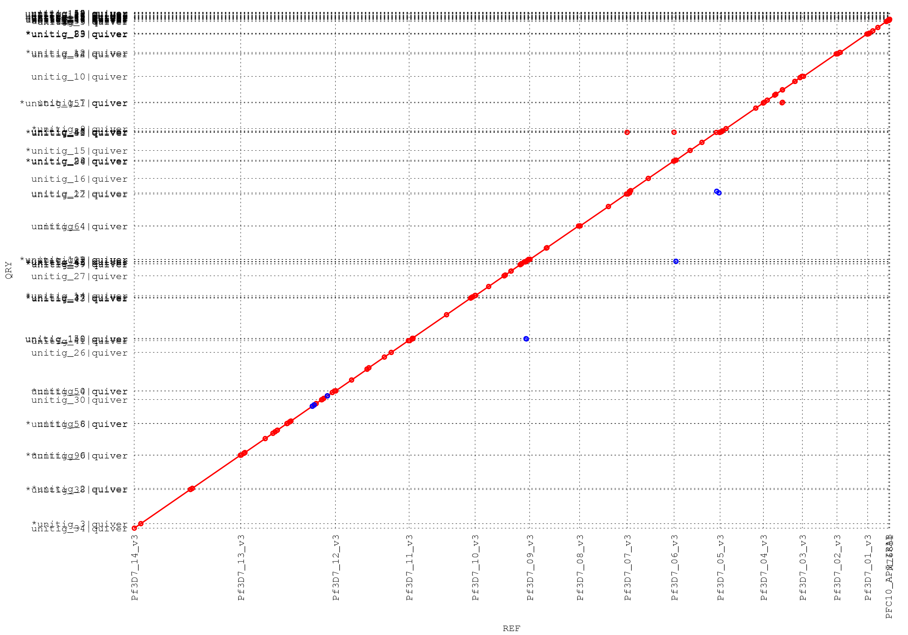

Lowering the barrier to entry for long-read sequencing with whole-genome amplification
==

Long-read sequencing can produce very long genomic fragments with an N50 of ~10-20 kb, with some fragments as long as ~50 kb.  However, they typically require a large amount of high molecular weight DNA (5 to 15 ug), limiting their applications.  Particular to malaria parasite sequencing, culturing a sufficient number of *Plasmodium falciparum* parasites to obtain the desired gDNA yield is enormously difficult and time-consuming.  Alternatively, one can consider whole-genome amplification on a small amount of DNA - say ~1 ng - to the requisite 15 ug level.  Standard WGA kits employing the Taq polymerase are inappropriate for such a task; Taq-produced amplicons are typically up to 3 or 4 kb, negating much of the value of long-read sequencing.  Instead, multiple displacement amplification (MDA) employs Phi-29, a polymerase with much higher replication fidelity and capability to generate amplicons greater than 20 kb in length.

We explored the use of MDA-based WGA to produce a draft-quality genome assembly of a malaria parasite genome.  Specifically, we amplified 1 ng of 3D7 to 15 ug and performed PacBio sequencing on the resulting amplicons.


 


|key            | numReads| minLength| maxLength| meanLength| n50Value|
|:--------------|--------:|---------:|---------:|----------:|--------:|
|3D7_CSHL_A01   |    46946|        50|     38351|   9622.495|    13685|
|3D7_CSHL_C01   |    49256|        50|     44451|  10274.992|    14412|
|3D7_CSHL_D01   |    40379|        50|     42929|  10874.385|    14128|
|3D7_PacBio_A01 |    63785|        50|     40660|   9725.101|    14767|
|3D7_PacBio_B01 |    71630|        51|     43816|   9932.797|    14851|
|3D7_PacBio_C01 |    89314|        50|     47379|  10767.940|    15354|
|3D7_PacBio_D01 |    91311|        50|     48366|  10733.769|    15334|
|3D7_PacBio_E01 |    94691|        50|     45388|  10271.377|    14274|
|3D7_PacBio_F01 |    85031|        50|     45460|  10228.038|    14368|
|3D7_PacBio_G01 |    47916|        50|     43162|  10397.394|    14460|
|3D7_PacBio_H01 |    68161|        50|     44561|  10278.915|    14452|


```
## Warning: NAs introduced by coercion
```

```
## Warning: NAs introduced by coercion
```

 


|id          | numContigs| minLength| maxLength|     n50|    ng50| totalSequence|
|:-----------|----------:|---------:|---------:|-------:|-------:|-------------:|
|3D7         |         16|      5967|   3291936| 1687656| 1687656|      23332831|
|unamplified |         34|     11443|   3293905| 1696391| 3293905|      23727741|
|IT          |         56|       580|   3219929| 1570953| 3219929|      22953932|
|amplified   |         79|       736|   1803583| 1251972| 1803583|      23422987|
|IGH-CR14    |        849|      2199|    120285|   37016|  120285|      21741172|
|HB3         |       1189|       201|    377975|   96469|  377975|      24258511|
|RAJ116      |       1199|      2042|     70306|   12998|   70306|      14106529|
|DD2         |       2837|       201|    102309|   19112|  102309|      20875591|
|V34.04      |       4329|       226|     16341|    3756|   16341|      13240777|
|D10         |       4471|       259|     19127|    3707|   19127|      13375079|
|K1          |       4772|       231|     18390|    3422|   18390|      13290906|
|7G8         |       4843|       204|     19000|    3832|   19000|      14278891|
|FCC-2       |       4956|       200|     17581|    3302|   17581|      12963854|
|RO-33       |       4991|       208|     19991|    3473|   19991|      13714138|
|D6          |       5011|       266|     15451|    3231|   15451|      13216528|
|SL          |       5193|       214|     55682|    3079|   55682|      13192745|
|VS.1        |       5856|       201|     22989|    4424|   22989|      18887633|
|PFCLIN      |      18711|      1001|     33813|    2992|   33813|      44265486|





|               |unamp_ref        |unamplified      |amp_ref          |amplified        |
|:--------------|:----------------|:----------------|:----------------|:----------------|
|TotalSeqs      |16               |34               |16               |79               |
|AlignedSeqs    |15(93.75%)       |34(100.00%)      |16(100.00%)      |79(100.00%)      |
|UnalignedSeqs  |1(6.25%)         |0(0.00%)         |0(0.00%)         |0(0.00%)         |
|TotalBases     |23332831         |23727741         |23332831         |23422987         |
|AlignedBases   |23283560(99.79%) |23716557(99.95%) |23029086(98.70%) |23408934(99.94%) |
|UnalignedBases |49271(0.21%)     |11184(0.05%)     |303745(1.30%)    |14053(0.06%)     |
|Breakpoints    |431              |409              |1152             |1042             |
|Relocations    |14               |3                |12               |6                |
|Translocations |15               |5                |53               |11               |
|Inversions     |6                |8                |6                |8                |
|Insertions     |82               |149              |638              |180              |
|InsertionSum   |65506            |419261           |650741           |592125           |
|InsertionAvg   |798.85           |2813.83          |1019.97          |3289.58          |
|TandemIns      |10               |18               |6                |11               |
|TandemInsSum   |2434             |33264            |444              |16193            |
|TandemInsAvg   |243.40           |1848.00          |74.00            |1472.09          |
|TotalSNPs      |1549             |1549             |1625             |1625             |
|AT             |194(12.52%)      |201(12.98%)      |291(17.91%)      |258(15.88%)      |
|AC             |65(4.20%)        |107(6.91%)       |58(3.57%)        |105(6.46%)       |
|AG             |153(9.88%)       |199(12.85%)      |160(9.85%)       |175(10.77%)      |
|TA             |201(12.98%)      |194(12.52%)      |258(15.88%)      |291(17.91%)      |
|TC             |204(13.17%)      |225(14.53%)      |115(7.08%)       |131(8.06%)       |
|TG             |74(4.78%)        |91(5.87%)        |84(5.17%)        |94(5.78%)        |
|CA             |107(6.91%)       |65(4.20%)        |105(6.46%)       |58(3.57%)        |
|CT             |225(14.53%)      |204(13.17%)      |131(8.06%)       |115(7.08%)       |
|CG             |20(1.29%)        |16(1.03%)        |76(4.68%)        |78(4.80%)        |
|GA             |199(12.85%)      |153(9.88%)       |175(10.77%)      |160(9.85%)       |
|GT             |91(5.87%)        |74(4.78%)        |94(5.78%)        |84(5.17%)        |
|GC             |16(1.03%)        |20(1.29%)        |78(4.80%)        |76(4.68%)        |
|TotalIndels    |13595            |13595            |19440            |19440            |
|A.             |1504(11.06%)     |4939(36.33%)     |5756(29.61%)     |3480(17.90%)     |
|T.             |1450(10.67%)     |4737(34.84%)     |5692(29.28%)     |3423(17.61%)     |
|C.             |156(1.15%)       |292(2.15%)       |367(1.89%)       |120(0.62%)       |
|G.             |208(1.53%)       |309(2.27%)       |477(2.45%)       |125(0.64%)       |
|.A             |4939(36.33%)     |1504(11.06%)     |3480(17.90%)     |5756(29.61%)     |
|.T             |4737(34.84%)     |1450(10.67%)     |3423(17.61%)     |5692(29.28%)     |
|.C             |292(2.15%)       |156(1.15%)       |120(0.62%)       |367(1.89%)       |
|.G             |309(2.27%)       |208(1.53%)       |125(0.64%)       |477(2.45%)       |


Quality of unamplified assembly: Q32.

Quality of amplified assembly: Q30.


|      | exons| exons_aligned| exons_perfect| exons_imperfect| exon_mean_nm| exon_mean_ni| exon_mean_nd|
|:-----|-----:|-------------:|-------------:|---------------:|------------:|------------:|------------:|
|ref   | 14767|         14375|         14375|             392|    0.0000000|    0.0000000|    0.0000000|
|unamp | 14767|         14312|         13850|             917|    0.1820151|    0.0084544|    0.0314421|
|amp   | 14767|         14330|         13838|             929|    0.2743196|    0.0264480|    0.0197488|


|              |IS_ALIGNED_U |NM_U |NI_U |ND_U |IS_ALIGNED_A |NM_A |NI_A |ND_A |
|:-------------|:------------|:----|:----|:----|:------------|:----|:----|:----|
|PF3D7_0100100 |TRUE         |0    |0    |0    |TRUE         |1    |0    |1    |
|PF3D7_0115700 |TRUE         |1    |0    |1    |TRUE         |0    |0    |0    |
|PF3D7_0200100 |TRUE         |2    |2    |0    |TRUE         |0    |0    |0    |
|PF3D7_0223500 |TRUE         |5    |4    |1    |TRUE         |1    |0    |1    |
|PF3D7_0300100 |TRUE         |0    |0    |0    |TRUE         |2    |2    |0    |
|PF3D7_0324900 |TRUE         |2    |1    |1    |TRUE         |0    |0    |0    |
|PF3D7_0400100 |TRUE         |2    |2    |0    |TRUE         |1    |1    |0    |
|PF3D7_0400400 |TRUE         |3    |2    |1    |TRUE         |1    |1    |0    |
|PF3D7_0412400 |TRUE         |4    |1    |2    |TRUE         |0    |0    |0    |
|PF3D7_0412700 |TRUE         |1    |0    |1    |TRUE         |1    |0    |1    |
|PF3D7_0412900 |TRUE         |4    |3    |1    |TRUE         |2    |2    |0    |
|PF3D7_0413100 |TRUE         |0    |0    |0    |TRUE         |1    |1    |0    |
|PF3D7_0420700 |TRUE         |1    |1    |0    |TRUE         |0    |0    |0    |
|PF3D7_0420900 |TRUE         |2    |1    |1    |TRUE         |0    |0    |0    |
|PF3D7_0421100 |TRUE         |2    |1    |1    |TRUE         |0    |0    |0    |
|PF3D7_0421300 |TRUE         |2    |2    |0    |TRUE         |1    |1    |0    |
|PF3D7_0425800 |TRUE         |0    |0    |0    |TRUE         |2    |2    |0    |
|PF3D7_0426000 |TRUE         |0    |0    |0    |TRUE         |0    |0    |0    |
|PF3D7_0500100 |TRUE         |4    |2    |0    |TRUE         |0    |0    |0    |
|PF3D7_0600200 |TRUE         |1    |1    |0    |FALSE        |0    |0    |0    |
|PF3D7_0600400 |TRUE         |0    |0    |0    |TRUE         |0    |0    |0    |
|PF3D7_0617400 |TRUE         |0    |0    |0    |TRUE         |0    |0    |0    |
|PF3D7_0632500 |TRUE         |0    |0    |0    |TRUE         |0    |0    |0    |
|PF3D7_0632800 |TRUE         |1    |1    |0    |TRUE         |0    |0    |0    |
|PF3D7_0700100 |TRUE         |3    |1    |1    |TRUE         |5    |3    |0    |
|PF3D7_0711700 |TRUE         |0    |0    |0    |TRUE         |0    |0    |0    |
|PF3D7_0712000 |TRUE         |1    |0    |1    |TRUE         |0    |0    |0    |
|PF3D7_0712300 |TRUE         |1    |0    |1    |TRUE         |2    |1    |1    |
|PF3D7_0712400 |TRUE         |0    |0    |0    |TRUE         |0    |0    |0    |
|PF3D7_0712600 |TRUE         |0    |0    |0    |TRUE         |0    |0    |0    |
|PF3D7_0712800 |TRUE         |0    |0    |0    |TRUE         |0    |0    |0    |
|PF3D7_0712900 |TRUE         |1    |1    |0    |TRUE         |1    |1    |0    |
|PF3D7_0733000 |TRUE         |3    |3    |0    |TRUE         |1    |1    |0    |
|PF3D7_0800100 |TRUE         |1    |1    |0    |TRUE         |0    |0    |0    |
|PF3D7_0800200 |TRUE         |0    |0    |0    |TRUE         |0    |0    |0    |
|PF3D7_0800300 |TRUE         |1    |1    |0    |TRUE         |0    |0    |0    |
|PF3D7_0808600 |TRUE         |0    |0    |0    |TRUE         |0    |0    |0    |
|PF3D7_0808700 |TRUE         |1    |0    |1    |TRUE         |3    |2    |0    |
|PF3D7_0809100 |TRUE         |1    |1    |0    |TRUE         |1    |0    |1    |
|PF3D7_0833500 |TRUE         |1    |0    |1    |TRUE         |0    |0    |0    |
|PF3D7_0900100 |TRUE         |2    |0    |1    |TRUE         |0    |0    |0    |
|PF3D7_0937600 |TRUE         |0    |0    |0    |TRUE         |0    |0    |0    |
|PF3D7_0937800 |TRUE         |6    |3    |1    |TRUE         |1    |1    |0    |
|PF3D7_1000100 |TRUE         |0    |0    |0    |TRUE         |2    |1    |0    |
|PF3D7_1041300 |TRUE         |1    |1    |0    |TRUE         |0    |0    |0    |
|PF3D7_1100100 |TRUE         |2    |2    |0    |TRUE         |1    |0    |1    |
|PF3D7_1100200 |TRUE         |2    |1    |1    |TRUE         |0    |0    |0    |
|PF3D7_1150400 |TRUE         |1    |0    |1    |TRUE         |2    |2    |0    |
|PF3D7_1200100 |TRUE         |4    |0    |2    |TRUE         |1    |1    |0    |
|PF3D7_1200400 |TRUE         |1    |1    |0    |TRUE         |1    |1    |0    |
|PF3D7_1200600 |TRUE         |1    |1    |0    |TRUE         |0    |0    |0    |
|PF3D7_1219300 |TRUE         |4    |1    |2    |TRUE         |1    |0    |1    |
|PF3D7_1240300 |TRUE         |3    |2    |1    |TRUE         |1    |0    |1    |
|PF3D7_1240400 |TRUE         |2    |1    |1    |TRUE         |0    |0    |0    |
|PF3D7_1240600 |TRUE         |3    |1    |0    |FALSE        |0    |0    |0    |
|PF3D7_1240900 |TRUE         |0    |0    |0    |TRUE         |0    |0    |0    |
|PF3D7_1255200 |TRUE         |5    |2    |1    |TRUE         |1    |1    |0    |
|PF3D7_1300100 |TRUE         |0    |0    |0    |TRUE         |0    |0    |0    |
|PF3D7_1300300 |TRUE         |0    |0    |0    |TRUE         |0    |0    |0    |
|PF3D7_1373500 |TRUE         |13   |9    |0    |TRUE         |0    |0    |0    |
